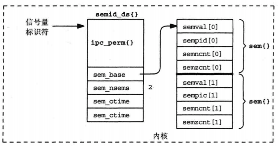

# System V 信号量


## 1. 概述
* 二值信号量(binary semaphore): 其值为0或1的信号量；
* 计数信号量(counting semaphore): 其值为0~某个限制值之间的信号量；
> * 以上两种信号量，等待(waiting)操作都等待信号量的值变为大于0；
* 计数信号量集(set of counting semaphores): 一个或多个信号量(构成一个集合), 其中的每个都是计数信号量。
    * System V信号量通过此概念给信号量增加了一级复杂度。
> 当讨论System V信号量时，都是指`计数信号量集`；当讨论Posix信号量时，都是指`计数信号量`。
* 约定：
    * semval: 信号量当前值
    * semncnt: 等待semval变为大于其当前值的线程数；
    * semzcnt: 等待semval变为0的线程数；
    * semadj: 所指定信号量针对调用进程的调整值；【？？？】

## 2.信号量集相关数据结构

```
struct semid_ds {
    struct ipc_perm     sem_perm;   // 操作权限
    struct sem          *sem_base;  // 指向信号量集数组的指针
    ushort              sem_nsems;  // 信号量集中信号量的数量
    time_t              sem_otime;  // 最后semop()的时间
    time_t              sem_ctime;  // 最后创建或IPC_SET的时间
}

struct sem {
    ushort_t    semval;     // 信号量值
    short       sempid;     // 最后成功semop()/SETVAL, SETALL的PID
    ushort_t    semncnt;    // awaiting semval > current vale的数量
    ushort_t    semzcnt;    // awaiting semval = 0 的数量
}

// 给信号量集中某个特定的信号量指定一个操作
// 不能静态初始化，顺序根据实现不同而不同
struct sembuf {
    short   sem_num;        // 信号量号：0, 1, ..., nsems-1
    short   sem_op;         // 信号量操作：<0, 0, >0
    short   sem_flg;        // 操作标记：0, IPC_NOWAIT, SEM_UNDO
}

// 此数据结构由用户定义，系统中没有定义
union semun {
    int             val;    // SETVAL使用
    struct semid_ds *buf;   // IPC_SET/IPC_STAT使用
    ushort          *array; // GETALL/SETALL使用
}
```

## 3. 相关函数
```c
#include <sys/sem.h>

// 创建或访问一个信号量集
// @nsems: 指定集合中的信号量数
// @oflag:
//  * IPC_CREAT: 不存在就创建，返回ID
//  * IPC_EXCL: 不管是否存在，都返回-1；
//  * IPC_CREAT|IPC_EXCL: 存在返回-1；不存在，创建，返回ID；
int semget(key_t key, int nsems, int oflag);

// 信号量操纵函数
// @opsptr->sem_op:
//  * > 0：加到信号量当前值上(semval)；如果指定SEM_UNDO标志，从相应信号量的semadj值中减去sem_op;
//  * = 0: 调用者希望等待信号量变为0；
//  * < 0: 等待信号量值变为`>=sem_op的绝对值`
int semop(int semid, struct sembuf *opsptr, size_t nops);

// 对一个信号量执行各种控制操作
// @cmd: GETVAL/SETVAL/GETPID/GETNCNT/GETZCNT/GETALL/SETALL/IPC_RMID/IPC_SET/IPC_STAT
int semctl(int semid, int semnum, int cmd, ... /*union semun org*/);
```

## 3. 注意
* semget()并不初始化信号量，初始化工作需要通过semctl来完成。这会存在问题如多次初始化。【详见[示例6_ex](./Examples/6_ex_lock_sv_sem.c)】
    * 解决方案是：指定`IPC_CREAT|IPC_EXCL`，保证只有一个进程创建信号量并初始化信号量。
        * 其他进程semget会放着EEXIST错误，并再次调用semget()。（一次不指定IPC_CREAT，也不指定IPC_EXCL）
        * 创建和初始化分为两步，这个方案还是存在竞争问题：
            * 进程A进行创建(semget)后，未进行初始化(semctl), 时间片到；进程B进行信号量操作（但是信号量还未初始化）。
            * 解决办法是：
                * 调用以IPC_STAT命令semctl，等待sem_otime变为非零值。
                * 原因：System V手册保证semget创建一个新的信号量集时，semid_ds的sem_otime成员一定被初始化为0。
* semop()睡眠时, 如果被中断，会返回`EINTR`错误；
    * semop()是需被所捕获的信号中断的`慢系统调用`。
* 删除信号量将导致等待此信号量的(睡眠中的)线程返回`EIDRM(identifier removed)`错误。
* 指定SEM_UNDO时，进程结束后，信号量会被还原。
