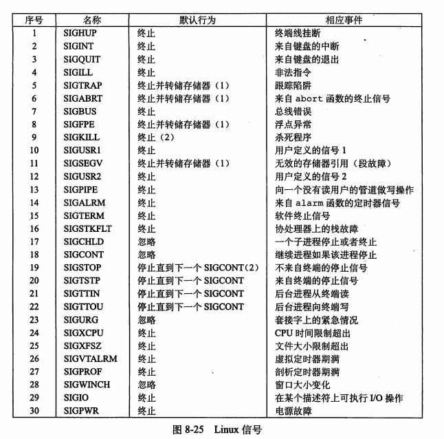

[TOC]

# 信号
* 一个信号就是一条小消息，它通知进程系统中发生了一个某种类型的事件。
* 每种信号类型都对应于某种系统事件。
* 信号的默认行为：

## 1.信号发送和信号接收
* `待处理信号`：一个发出而没有被接收的信号。
* 内核通过更新目的进程上下文的某个状态，发送一个信号给目的进程。
* 当目的进程被内核`强迫`以某种方式对信号的发送做出反应时，目的进程就接收了信号。
* Unix 系统提供了大量向进程发送信号的机制，所有这些机制都是基于`进程组(process group)`的。
* 相关函数：
```c
#include <sys/types.h>
#include <signal.h>
#include <unistd.h>

// 发送 sig 指定信号到 pid 进程
int kill(pid_t pid, int sig);

// 向自己发送 SIGALRM 信号
unsigned int alarm(unsigned int secs);

typedef void (*sighandler_t)(int);
sighandler_t signal(int signum, sighandler_t handler);
```

## 2.信号处理问题
* 待处理信号被阻塞。
  * 例如：一个进程捕获一个信号 SIGINT 然后去处理程序处理信号，此时又来一个 SIGINT 信号，此信号会被阻塞。[疑问][1]
  * （第 2 个信号不是 SIGINT 信号，那是否也还是阻塞？）
* 待处理信号不会排队等待。
  * 任意类型至多只有一个待处理信号。[疑问][2]
  * （不同类型的信号就可以有多个吗？）
* 系统调用可以被中断。
  * 如 read、wait、accept 这样的`慢速系统调用`被信号打断，但是信号处理函数返回后不再继续被打断的系统调用，而是立即返回错误，errno 为`EINTR`。

* 详见[ex_SIGCHLD.c](./Examples/ex_SIGCHLD.c)
* **教训：不可以用信号来对其他进程中发生的时间计数**

## 3. 显式地阻塞和取消阻塞信号
这 2 个操作在某些情况下也是什么有用的，且必须的，能消除一些竞争条件。（详见[ex3](./Examples/3_ex_procmask_bug.c)和[ex4](./Examples/4_ex_procmask_fix_bug.c)）
* 相关函数
```c
#include <signal.h>
// 设置阻塞、不阻塞、添加到阻塞
int sigprocmask(int how, const sigset_t *restrict set, sigset_t *restrict oset);
// 添加 signo 到 set 中
int sigaddset(sigset_t *set, int signo);
// 吧 signo 从 set 中删除
int sigdelset(sigset_t *set, int signo);
// 初始化 set 为空集
int sigemptyset(sigset_t *set);
// 将每个 (所有？) 信号添加到 set 中
int sigfillset(sigset_t *set);
// 判断 signo 是否是 set 的成员，是返回 1，否则 0
int sigismember(const sigset_t *set, int signo);
```

## A.拓展
* 进程组。详见[1.进程](../../1.进程)
* Linux 信号
  
* 回收子进程的方式：用 SIGCHLD 信号。子进程终止时，会发送 SIGCHLD 信号给其父进程。【详见[ex_SIGCHILD.c](./Examples/ex_SIGCHLD.c)】
* 可移植的 signal 函数。【详见[isshe_signal.h](../../A.lib/isshe_signal.h)和[isshe_signal.c](../../A.lib/isshe_signal.c)】
* 非本地跳转：可和信号一起实现程序重启功能。【详见[ex_restart](./Examples/5_ex_restart.c)，macOS 上行为和书本有所不同】
    * 相关函数
    ```c
    #include <setjmp.h>
    int setjmp(jmp_buf env);
    void logjmp(jmp_buf env, int retval);
    // 下面两个可以和信号一起用
    int sigsetjmp(sigjmp_buf env, int savesige);
    void siglongjmp(sigjmp_buf env, int retval);
    ```

## B.疑问
* `2.信号处理问题`中：
[1]第 2 个信号不是 SIGINT 信号，那是否也还是阻塞？
[2]不同类型的信号就可以有多个吗？

## C.参考
* 《深入理解计算机系统》