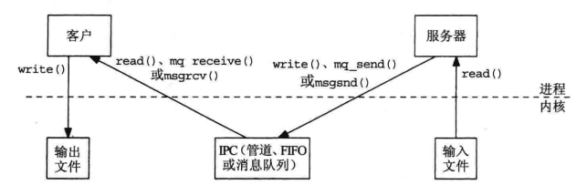
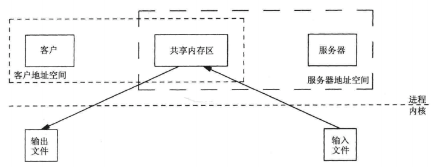
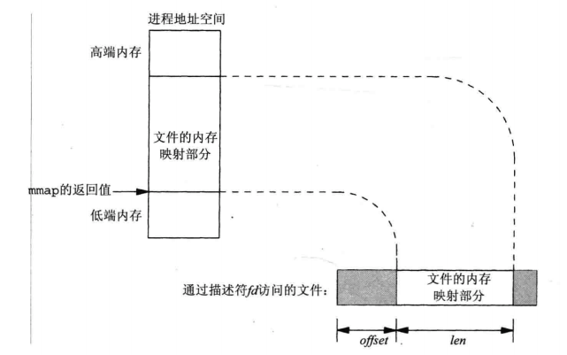
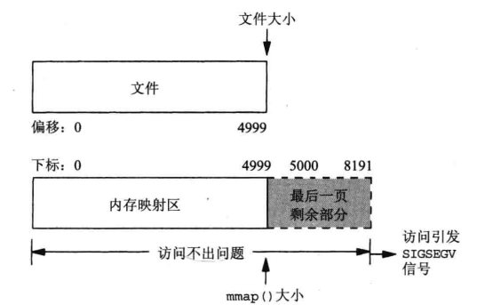
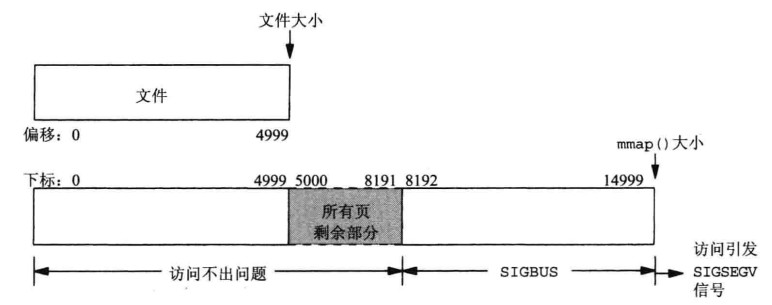

[TOC]

# Posix 共享内存区
* 共享内存区是可用 IPC 形式中最快的。
* 一旦内存区映射到共享它的进程的地址空间，这些进程间的数据传递就不需要经过内核了；但是读写内存区时，需要进行同步。
* 非共享缓冲区读文件传给另一个进程写：4 次内核与内核的交互

* 共享缓冲区读文件传给另一个进程写：2 次内核与进程的交互


## 1. 相关函数

### 1.1 mmap
* mmap: 把一个文件或一个 Posix 共享内存区对象映射到调用进程的地址空间。
* 使用此函数有 3 个目的：
    * 使用普通文件以提供内存映射 I/O；
    * 使用特殊文件以提供匿名内存映射；
    * 使用 shm_open 以提供无亲缘关系进程间的 Posix 共享内存区。
* 映射文件示意图：


```c
#include <sys/mman.h>

// addr: 指定 fd 映射到的进程内空间的起始地址；
// len: 映射的长度——字节数；
// offset: 从被映射文件开头起 offset 字节开始映射；
// prot: 属性/模式 (PROT_READ|PROT_WRITE|PROT_EXEC|PROT_NONE)
//  * PROT_NONE   Pages may not be accessed.
//  * PROT_READ   Pages may be read.
//  * PROT_WRITE  Pages may be written.
//  * PROT_EXEC   Pages may be executed.
// flag: 很多歌，具体见 man
//  * MAP_PRIVATE: 变动私有，不改变低层支撑对象；
//  * MAP_SHARED: 变动共享，其他进程可见，改变低层支撑对象；
//  * MAP_FIXED: 准确地解释 addr 参数；【？？？】
// 返回：成功——映射起始地址；失败——MAP_FAILED，设置 errno
void *mmap(void *addr, size_t len, int prot, int flags, int fd, off_t offset);
```

### 1.2 munmap
* munmap: 从某个进程的地址空间删除一个映射关系。
```c
#include <sys/mman.h>

int munmap(void *addr, size_t len);
```

### 1.3 msync
* msync: 同步内存与硬盘上的内容。
```c
#include <sys/mman.h>

// flags: 
//  * MS_ASYNC: 执行异步写（写操作入内核队列，就返回）
//  * MS_SYNC: 执行同步写（写操作完成后才返回）
//  （以上两个指定一个，但不能都指定）
//  * MS_INVALIDATE: 使高速缓存的数据失效
int msync(void *addr, size_t len, int flags);
```

## 2. 文件内存映射
内存映射一个普通文件时，内存中映射区的大小 (mmap 的第 2 个参数) 通常等于改文件的大小。
详见[示例](./Examples/2_ex_shm_increase2.c)

## 3. 匿名内存映射
使用非匿名内存映射时，需要在文件系统中创建一个文件，进行 open 并 write 一些数据进行初始化。
如果目的是提供一个父子进程共享的内存映射，匿名内存映射则能简化上述流程。
创建匿名映射的方法：
* mmap 的 flag 参数指定`MAP_SHARED|MAP_ANON`, fd = -1。
* 这样的内存区会被初始化为 0；
详见[示例](./Examples/3_ex_increase_map_anon.c)

## A. 注意
* 从移植性考虑，MAP_FIXED 不应该指定。
* 可移植的代码，应该把 addr 指定为 NULL，并且不指定 MAP_FIXED。
* mmap 成功返回后，fd 可关闭。
* 不是所有文件都能 mmap。

## B.问题
* 为什么使用 mmap？
    * 不用调用 read/write/lseek，简化了代码。
* 当映射的内存大于文件大小？等于文件大小？
    * macOS 的 man 手册中，明确说明，文件映射的内存不是`页`的倍数时会被扩充。【详见[示例](./Examples/5_ex_shm_test_filesize_mmapsize.c)】
    * 等于：
        * 
    * 大于：
        * **SIGBUS 意味着：是在内存映射区访问，但是超出了低层支撑对象的大小。**
        * 
* 如何映射一个持续增长的文件？
    * 映射比文件大的多的区域，随着文件增长再对相应区域进行访问。
    * 详见[示例](./Examples/6_ex_shm_test2_map_inc_file.c)


