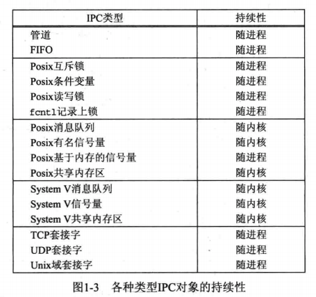
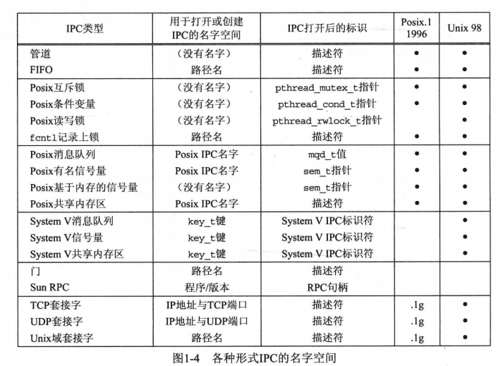
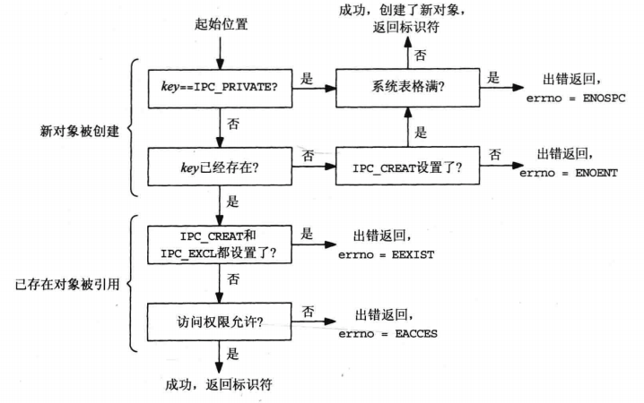
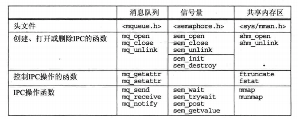
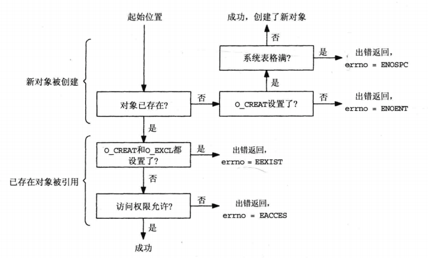

[TOC]

# 进程间通信
* 进程间通信：InterProcess Communication，IPC
* UNIX 进程间共享信息的三种方式：

* IPC 对象的持续性
    * 随进程 (process-persistent)：IPC 对象生存到最后关联进程终止；
    * 随内核 (kernel-persistent)：IPC 对象生存到内核重启或者显式删除为止；
    * 随文件系统 (filesystem-persistent)：IPC 对象生存到显式删除为止；

* 名字空间：对于给定 IPC 类型，它所有可能的名字的集合。


## 1. 类型
### 1.1 经典 IPC
* 管道
* FIFO
* Systemv: 消息队列、信号量、共享内存
* Posix: 消息队列、信号量、共享内存

### 1.2 IPC 类型

* 前 10 种 IPC 通常只能用于同一台主机

## 2. XSI(Systemv) IPC
* System v IPC：消息队列、信号量、共享存储器。
* 创建/打开一个 IPC 对象的逻辑

* 结果

|oflag 标记|key 不存在|key 已存在|
|---|---|---|
|无特殊标记 | 出错，errno = ENOENT|成功，引用已存在对象|
|O_CREAT|成功，创建新对象 | 成功，引用已存在对象|
|O_CREAT O_EXCL|成功，创建新对象 | 出错，errno = EEXIST|

### 2.1 不同 XSI IPC 相似之处
* 非负整数的`标识符`。
    * 标识符是 IPC 对象的内部名。为使不同进程能在同一 IPC 上汇聚，每个 IPC 对象都与一个`键(key)`相关联。
    * `键(key)`是 IPC 对象的外部名。

### 2.2 不同进程协作方法
* 1）服务器进程指定键 IPC_PRIVATE 创建一个新的 IPC 结构，将返回的标识符写到文件，供客户端进程读取。
    * 缺点：需写到文件，再读文件。
* 2）用公用头文件定义键。服务器进程用此键创建新的 IPC 结构。
    * 缺点：key 对应的 IPC 结构可能已存在。需处理此情况。
* 3）服务器进程、客户进程都使用相同的路径名和项目 ID(0-255)，用`ftok()`生成`键(key)`。
```c
#include <sys/ipc.h>

// path: 现用的文件
// id: 只使用低 8 位
key_t ftok(const char *path, int id);
```

### 2.3 权限结构
* 每个 IPC 结构关联一个`ipc_perm`结构：
```c
struct ipc_perm {
    uid_t uid;      // 所有者的有效用户 ID
    gid_t gid;      // 所有者的有效组 ID
    uid_t cuid;     // 创建者的有效用户 ID
    gid_t cgid;     // 创建者的有效组 ID
    mode_t mode;    // 权限
}
```
* 权限

|权限 | 位|
|---|---|
|用户读|0400|
|用户写 (更改)|0200|
|组读|0040|
|组写 (更改)|0020|
|其他读|0004|
|其他写 (更改)|0002|

### 2.4 优缺点
* 3 种形式的 XSI IPC 都有内置限制。（大多限制可以通过重新配置内核来改变）
* 缺点：
    * IPC 结构是系统范围内起作用的，但是没有引用计数。
        * 所有使用这些 IPC 的进程都终止了，这些 IPC 也不会删除。需显式删除。
    * 这些 IPC 结构在文件系统中没有名字。需要用 ipcs/ipcrm 查看/删除。
    * 难以一次使用多个 IPC 结构。
        * 不是文件描述符，无法使用像 select/poll 这样的多路复用函数。
* 优点：
    * 可靠地、流控制的、面向记录的。
        * 它们可以用非先进先出次序处理。
* 不同形式的 IPC 对比：
    * 无连接：无需先调用某种形式的打开函数就能发送消息的能力。
    * 可靠：被限制在一台主机上，因此都是可靠的。如果通过网络传送，就要考虑丢失消息的问题。
    * 流控制：如果系统资源短缺，或者接收进程不能再接收更多消息，则发送进程就要休眠。
        * 流控制条件消失时，发送进程自动唤醒。

|IPC 类型 | 无连接？|可靠的？|流控制？|记录？|消息类型或优先级？|
|---|---|---|---|---|---|
|消息队列 | 否 | 是 | 是 | 是 | 是|
|STREAMS|否 | 是 | 是 | 是 | 是|
|UNIX 域流套接字 | 否 | 是 | 是 | 否 | 否|
|UNIX 域数据报套接字 | 是 | 是 | 否 | 是 | 否|
|FIFO(非 STRAMS)|否 | 是 | 是 | 否 | 否|

### 2.A 注意
* 决不能指定`IPC_PRIVATE`作为键来引用一个现有队列。因为这个键值总是用于创建一个新队列。
    * 为了引用一个用 IPC_PRIVATE 创建的现有队列，一定要知道相关的标识符。在其他 IPC 调用中使用标识符，这样可绕过 get 函数。

## 3. Posix IPC
Posix IPC: 消息队列、信号量、共享内存区
### 3.1 概述
* Posix IPC 函数汇总

* 三种类型的 posixIPC 都使用`Posix IPC名字`进行标识。

### 3.2 创建/打开 IPC 通道
* 相关函数：
    * mq_open
    * sem_open
    * shm_open
* 打开或创建 Posix IPC 对象所用的 oflag 常值

* 打开/创建一个 IPC 对象的逻辑


* 结果

|oflag 标记 | 对象不存在 | 对象已存在|
|---|---|---|
|无特殊标记 | 出错，errno = ENOENT|成功，引用已存在对象|
|O_CREAT|成功，创建新对象 | 成功，引用已存在对象|
|O_CREAT O_EXCL|成功，创建新对象 | 出错，errno = EEXIST|

## A.拓展
* 关于各种 IPC 及同步的性能测量：《UNIX 网络编程 卷 2》附录 A 性能测量
    * 带宽 (bandwidth)；
    * 延迟 (latency)；
