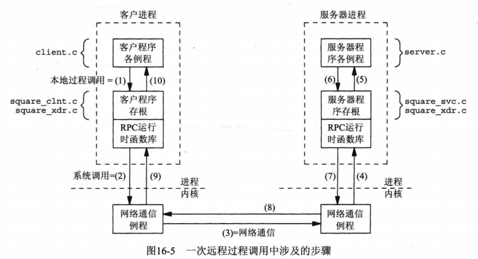

[TOC]

# Sun RPC

构建一个应用程序通常由两种方式：
* 构建一个庞大的单一程序，完成全部工作；
* 把整个应用程序散布到彼此通信的多个进程中；
    * 单一主机（信号量、共享内存区等用于进程间通信）
    * 多主机（某种形式的网络通信）
* 不同部分之间进行网络通信的应用程序，可以分为：
    * 显式网络编程：socket、connect、accept、read、write 等；
    * 隐式网络编程：远程过程调用（RPC）
    
## 相关函数
### 1.1 clnt_create 函数
```c
#include <rcp/rpc.h>

CLIENT *clnt_create(const cahr *host, unsigned long program, 
                    unsigned long versnum, const char *protocol);
```
* 作用：返回一个客户句柄
* 参数：
    * host：运行服务器的主机名/ip 地址；
    * program：程序名；
    * versnum：版本号；
    * protocol：协议，tcp 或 udp；

### 1.2 clnt_control 函数
```c
bool_t clnt_control(CLIENT *cl, unsigned int request, char *ptr);
```
* 作用：设置、查询客户句柄 (由 clnt_create 打开) 的选项；
    * 类似于给描述符调用 fcntl；
    * 类似于给套接字调用 getsockopt、setsockopt；
* 参数：
    * cl：客户句柄；
    * request：操作类型；
    * info：指向信息的指针；（info 指向的内容取决于 request）
* 返回：成功，TRUE；出错，FALSE
* 详见：man 手册

## 2. 如何构建一个 RPC 客户端 - 服务器程序？


## 3. 一次远程调用涉及的步骤有哪些？

* 1) 本地过程调用；
* 2) `客户程序存根`发送网络信息给`远程系统`（通过 write/sendto）；
* 3) 网络通信，传送网络消息给`远程系统`；
* 4) `服务器程序存根(server stub)`一直在远程系统上等待客户的请求；
* 5) `服务器程序存根`执行本地过程调用，以激活真正的服务器函数 (squareproc_1_svc)；
* 6) `服务器过程`完成，向`服务器程序存根`返回返回值；
* 7) `服务器程序存根`在必要时对返回值进行转换，集结到一个或多个网络消息中，返回给`客户`；
* 8) 网络消息通过网络传回给客户；
* 9) `客户程序存根`从本地内核读取网络信息 (read/recvfrom)
* 10) 返回值进行可能的转换后，`客户程序存根`返回`客户函数`；

## A. 一次完整的流程
如[1_1_ex](./Examples/1_1_ex_square.x)
* 建立`.x`文件，如`1_1_ex_square.x`
* 通过`rpcgen -C -a 1_1_ex_square.x`生成所有需要的问题；
    * 如果不指定`-a`，则不会生成客户端、服务器文件；
* 修改客户端、服务器文件；
* 编译、运行即可；
* 具体参见`1_1_ex示例`及其[Makefile](./Examples/Makefile)

## B. 注意
* 服务器 sleep 后，客户端会等待；
    * 详见[1_2_ex](./Examples/1_2_ex_square_server.c)

## B. 拓展
> 不知道是否常用，先初步学习，以下是更深入的内容
> 以下内容：《UNIX 网络编程 卷 2》16.3~16.9
* 多线程化；
* 服务器捆绑；
* 认证；
* 超时和重传；
    * TCP 管理；
    * 事务 ID；(XID)
        * 一个 32 位整数；(长度应该是自定义)
        * 超时、重传时 XID 不变；
        * 每个新的请求，都用新的 XID；
        * 可使用以下算法请求选择一个 XID:(`^`为异或)
        ```c
        struct timeval now;
        gettimeofday(&now, NULL);
        xid = getpid() ^ now.tv_sec ^ now.tv_usec;
        ```
    * 服务器重复请求高速缓存
* 调用语义
* 客户或服务器的过早终止
* XDR：外部数据表示
* RPC 分组格式

* 相关工具：
    * rpcgen
    * rpcbind
    * rpcinfo
