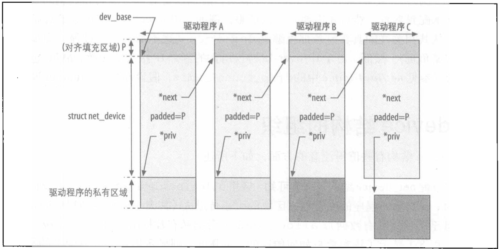
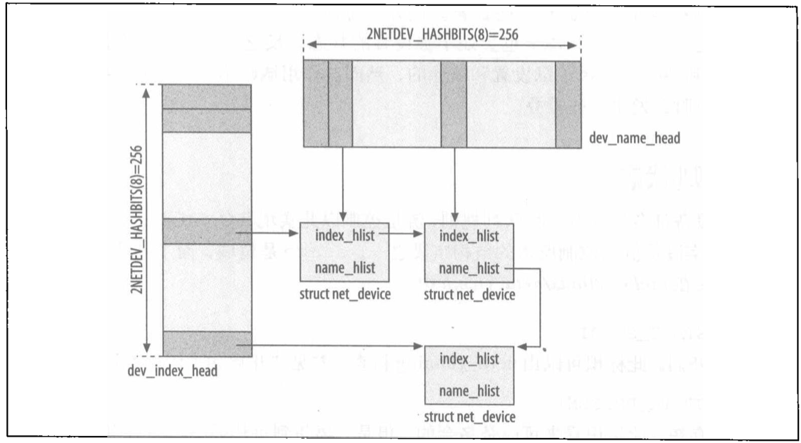
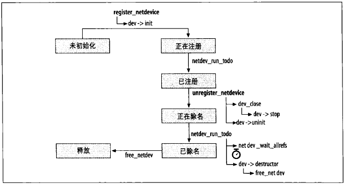
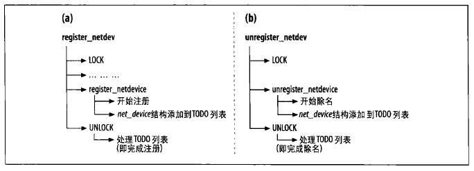

# net_device
此数据结构存储着特定网络设备的所有信息。

## net_device 结构中字段的分类
* 配置（Configuration）
* 统计数据（Statistics）
* 设备状态（Device status）
* 列表管理（List management）
* 流量管理（Traffic management）
* 功能专用（Feature Specific）
* 通用（Generic）
* 函数指针（或 VFT）

## net_device 结构的组织
已注册设备全局列表：

根据设备名称和设备索引搜寻 net_device 的 hash 表：


net_device 结构一些值得注意的方面，如：
* 调用 alloc_netdev 分配 net_device 结构时，会把驱动程序的私有数据区块的大小传进去。
    * alloc_netdev 会把私有数据附加到 net_device 结构中。
    * 私有数据的大小及内容随设备类型不同而不同。
* dev_base 和 net_device 中的 next 指针指向 net_device 结构的开头，而非已分配区块的开头。
    * 开头补空白空间的大小存储在`dev->padded`中，方便内核释放内存区块。
* dev_base: 内含所有 net_device 实例的全局列表能够让内核轻易浏览设备。
* dev_name_head: 这是一张 hash 表，以设备名称为索引。
* dev_index_head: 这是一张 hash 表，以设备 ID `dev->ifindex`为索引。
    * 存储设备 ID 供交叉引用。
* 最常见的查询都是通过`设备名称`和`设备ID`进行的。(就是前面说的两张 hash 表：dev_name_head/dev_index_head)
    * dev_get_by_name()
    * dev_get_by_index()
    * 所有查询都由`dev_base_lock`锁保护。
    * 详见：`net/core/dev.c`

## 设备状态
### 队列规则状态
每个网络设备都会被分派一种队列规则，流量控制以此实现其 QoS 机制。
net_device.state 是流量控制所用的结构字段之一。取值详见`include/linux/netdevice.h`。
```c
enum netdev_state_t {
	__LINK_STATE_START,	// 设备开启，由 netif_running() 检查
	__LINK_STATE_PRESENT,	// 设备存在，由 netif_device_present() 检查
	__LINK_STATE_NOCARRIER, //没有载波，由 netif_carrier_ok() 检查
	__LINK_STATE_LINKWATCH_PENDING,
	__LINK_STATE_DORMANT,
};
```

### 注册状态
设备和网络协议栈之间的注册状态存储在`net_device.reg_state`字段中。
字段取值见`include/linux/netdevice.h`的`NETREG_XXX`相关。
```c
enum { NETREG_UNINITIALIZED=0, 	/* net_device 结构已分配而且其内容都已清零 */
       NETREG_REGISTERED,		/* 设备已完成注册 */
       NETREG_UNREGISTERING,	/* 调用了 unregister_netdevice */
       NETREG_UNREGISTERED,	/* 设备已完成注销/除名，但是 net_device 结构还没释放掉 */
       NETREG_RELEASED,		/* 调用了 free_netdev，所有对 net_device 的引用到释放了，此结构可以被释放了 */
       NETREG_DUMMY,		/* dummy device for NAPI poll（用于 NAPI 轮询的虚拟设备） */
} reg_state:8;
```
状态转换 -《深入理解 Linux 网络技术内幕》158 页图 8-4：

* 状态的改变会用到界于`NETREG_UNINITIALIZED`和`NETREG_REGISTERED`之间的中间状态。（这些进程由`netdev_run_todo`处理）

## 分配 net_device
```c
#include <linux/netdevice.h>

#define alloc_netdev(sizeof_priv, name, name_assign_type, setup) \
	alloc_netdev_mqs(sizeof_priv, name, name_assign_type, setup, 1, 1)
```
* 作用：分配 net_device 结构。
* 参数：
    * sizeof_priv: 私有数据大小？
    * name: 设备名称
    * name_assign_type: 
    * setup: 

相关包裹函数：

|网络设备类型 | 包裹函数名称 | 包裹函数定义 |
|------|------|------|
|以太网 (Ethernet)|alloc_etherdev||
|光纤分布式数据接口 (FDDI)|alloc_fddidev||
|高性能并行接口 (HPPI)|alloc_hippi_dev||
|令牌环 (Token Ring)|alloc_trdev||
|光纤通道 (Fibre Channel)|alloc_fcdev||
|红外数据标准协会 (InDA)|alloc_irdadev||

## 设备注册/注销
```c
#include <linux/netdevice.h>    // 实现在 net/core/dev.c 中

int register_netdev(struct net_device *dev);
void unregister_netdev(struct net_device *dev);
```
* 作用：注册或注销设备。
* 参数：
    * dev: 要注册/注销的设备
* 以上两个分别是：`register_netdevice()`和`unregister_netdevice()`的包裹函数。
* 注意：
    * 设备的注册和注销都是通过`netdev_run_todo()`完成的。
    * 为设备注册/注销时，设备驱动程序可以使用`init()`和`uninit()`这两个 net_device 虚拟函数，分别对私有数据做初始化以及清理工作。
    * 对设备注销时，除非对相关联的 net_device 引用都已全部释放，否则无法完成：netdev_wait_allrefs 不会反悔，直到条件满足。

### netdev_run_todo


```c
void rtnl_unlock(void)
{
	/* This fellow will unlock it for us. */
	netdev_run_todo();
}
```
* 注册由：`register_netdevice()`和`netdev_run_todo()`共同完成，详见下图。
* 对`net_device`的修改，会受到`rtnl_lock()/rtnl_unlock()`操作的`Routing Netlink`信号量的保护。
* `register_netdevice()`完成其份内工作后，就会用`net_set_todo()`把`net_device`结构添加到`net_todo_list`
* `net_todo_list`内的设备，注册都必须完成才行。列表不会由另一个内核线程处理或通过定时定时器处理，而是由`register_netdev`在释放锁的时候，**间接处理**。
* 任何时刻，只有一个 CPU 可以执行`net_run_todo()`，串行化是通过`net_todo_run_mutex`互斥体实现的。
    * **`net_todo_run_mutex`在`4.19.60`中已找不到，应该是删掉了！**
* `netdev_run_todo()`处理任务时，不用持有锁，因此此函数可以安全进入休眠状态。

### 设备注册/注销状态通知
内核组件和用户控件应用程序，可能都想直到什么时候发生了`设备注册、注销、关闭、打开`等事情。这类通知有两种方式：
* netdev_chain: 内核组件可以注册此类通知链。
* Netlink 的`PTMGRP_LINK`多播群组：用户控件应用程序可以注册 Rtnetlink 的 RTMGRP_LINK 多播群组。

#### netdev_chain 通知链
> 通知链详见：[通知链](../../8.通知链/Readme.md) 和《深入理解 Linux 网络技术内幕》第 4 章

netdev_chain 通知链，定义在`net/core/dev.c`中，内核组件可以通过`register_netdevice_noitifier`和`unregister_netdevice_notifier`对该链进行注册和注销。
netdev_chain 报告的事件类型：`NETDEV_XXX`，详见`include/linux/netdevice.h`，已进行部分注释。
**注意：**
* 向链注册 (感兴趣事件？) 时，`register_netdevice_notifier`会 (仅对新注册者) 重放当前系统已注册设备所有过去的`NETDEV_REGISTER`和`NETDEV_UP`通知信息。
    * 这样可以给新注册者有个已注册设备当前状态的清晰图像。
注册`netdev_chain`的一些内核组件：
* 路由
* 防火墙
* 协议代码：ARP、IP 等
* 虚拟设备
* RTnetlink

#### Rtnetlink 链接通知
当设备的状态和配置有变更时，(内核？) 就会用`rtmsg_ifinfo`（内核接口）把通知信息传送给 Netlink 多播群组`RTMGRP_LINK`。
`netplugd`是会监听通知信息的守护进程。事件发生后，会根据用户配置进行反应。详见 netplugs man page。

## 参考
* 《深入理解 Linux 网络技术内幕》
* 《Linux 4.19.60》


