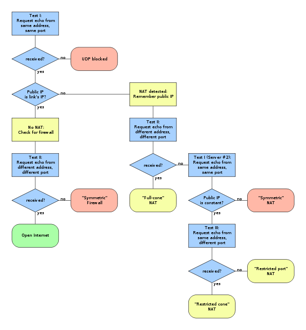

[TOC]

# NAT类型检测工具

## 1.前置依赖
假设环境为ubuntu环境：
* sudo apt-get install lua luarocks
* sudo luasocket: luarocks install luasocket
* sudo lua-cjson: luarocks install lua-cjson

## 2. 拓扑图
```
                 [Server1]
                /
[Client] - [NAT]
                \
                 [Server2]
```
* Server1和Server2可以是一台设备的两个Wan口，或者是两台设备。


## 3.使用方法
* 修改stun_server3.lua里面的IP+其他服务器IP，然后运行第一个服务器。
* 修改stun_server3.lua里面的IP+其他服务器IP，然后运行第二个服务器。
* 修改stun_client3.lua里面的客户端IP，服务器IP（两个）
* 运行stun_client3.lua，进行测试。

## 4.检测方法
* 检测流程


## 5.使用示例
* 拓扑图
```
                                       [Server1](192.168.2.B)
                                      /
[Client](172.16.0.X) - (172.16.0.Y)[NAT](192.168.2.A)
                                      \
                                       [Server2](192.168.2.C)
```
* 步骤
* 开第一个服务器：
```shell
lua ./stun_server.lua 192.168.2.B 192.168.2.C
```
* 开第二个服务器
```shell
lua ./stun_server.lua 192.168.2.C 192.168.2.B
```
* 运行客户端进行测试
```shell
lua ./stun_client.lua 172.16.0.X 192.168.2.B 192.168.2.C
```


## X.参考
* https://zh.wikipedia.org/wiki/STUN