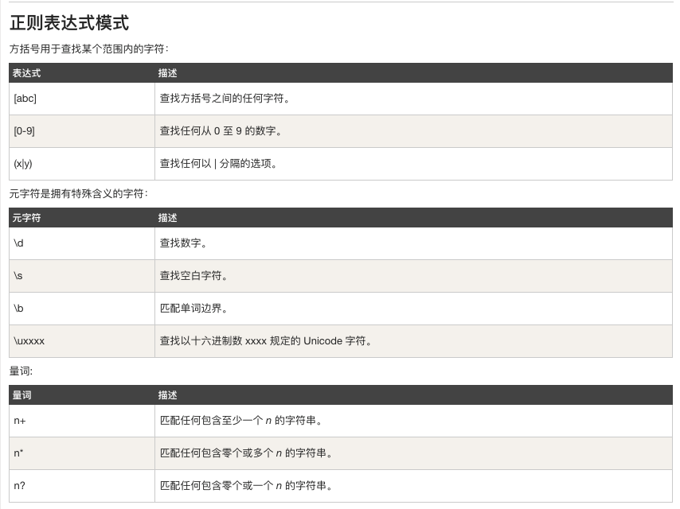

[TOC]

# JavaScript
* [JavaScript 实例](http://www.runoob.com/js/js-examples.html)
* [JavaScript 对象 实例](http://www.runoob.com/js/js-ex-objects.html)
* [JavaScript Browser 对象 实例](http://www.runoob.com/js/js-ex-browser.html)
* [JavaScript HTML DOM 实例](http://www.runoob.com/js/js-ex-dom.html)
* [JavaScript 对象、浏览器对象、HTML DOM 对象参考手册](http://www.runoob.com/jsref/jsref-tutorial.html)

## 1. 什么是 JavaScript？
* JavaScript 是互联网上最流行的脚本语言，可用于`HTML`和`web`，更可广泛用于服务器、PC、笔记本电脑、平板电脑和智能手机等设备
* JavaScript 是一种轻量级的编程语言。
* JavaScript 是可插入 HTML 页面的编程代码。
* JavaScript 插入 HTML 页面后，可由所有的现代浏览器执行。
* JavaScript 对大小写是敏感的。
* JavaScript 使用 Unicode 字符集。

## 2. JavaScrip 用法
* HTML 中的脚本必须位于`<script>`与`</script>`标签之间。
* 脚本可被放置在 HTML 页面的`<body>`和`<head>`部分中。

## 3. JavaScrip 输出
JavaScript 可以通过不同的方式来输出数据：
* 使用 window.alert() 弹出警告框。
* 使用 document.write() 方法将内容写到 HTML 文档中。
* 使用 innerHTML 写入到 HTML 元素。
* 使用 console.log() 写入到浏览器的控制台

## 4. JavaScript 关键字
* 详细保留关键字见：[JavaScript 保留关键字](http://www.runoob.com/js/js-reserved.html)
|关键字 | 关键字 | 关键字 | 关键字|
|---|---|---|---|
|abstract|else|instanceof|super|
|boolean|enum|int|switch|
|break|export|interface|synchronized|
|byte|extends|let|this|
|case|false|long|throw|
|catch|final|native|throws|
|char|finally|new|transient|
|class|float|null|true|
|const|for|package|try|
|continue|function|private|typeof|
|debugger|goto|protected|var|
|default|if|public|void|
|delete|implements|return|volatile|
|do|import|short|while|
|double|in|static|with|

## 5. JavaScript 语句标识符
|语句 | 描述|
|---|---|
|break|用于跳出循环。|
|catch|语句块，在 try 语句块执行出错时执行 catch 语句块。|
|continue|跳过循环中的一个迭代。|
|do ... while|执行一个语句块，在条件语句为 true 时继续执行该语句块。|
|for|在条件语句为 true 时，可以将代码块执行指定的次数。|
|for ... in|用于遍历数组或者对象的属性（对数组或者对象的属性进行循环操作）。|
|function|定义一个函数|
|if ... else|用于基于不同的条件来执行不同的动作。|
|return|退出函数|
|switch|用于基于不同的条件来执行不同的动作。|
|throw|抛出（生成）错误。|
|try|实现错误处理，与 catch 一同使用。|
|var|声明一个变量。|
|while|当条件语句为 true 时，执行语句块。|

## 6. JavaScript 对象
JavaScript 对象类似于：
* PHP 中的关联数组
* Python 中的字典
* C 语言中的哈希表
* Java 中的哈希映射
* Ruby 和 Perl 中的哈希表

## 7. JavaScript 事件
`HTML事件`是发生在`HTML元素`上的事情。
当在 HTML 页面中使用 JavaScript 时，JavaScript 可以触发这些事件。

* 一些常见的 HTML 事件
|事件 | 描述|
|---|---|
|onchange|HTML 元素改变|
|onclick|用户点击 HTML 元素|
|onmouseover|用户在一个 HTML 元素上移动鼠标|
|onmouseout|用户从一个 HTML 元素上移开鼠标|
|onkeydown|用户按下键盘按键|
|onload|浏览器已完成页面的加载|

## 8. JavaScript 字符串
* 见[字符串属性&字符串方法](http://www.runoob.com/js/js-strings.html)

## 9. JavaScript 数据类型
* string
* number
* boolean
* object
* function
* Object
* Date
* Array
* null
* undefined

## 10. 正则表达式
正则表达式：Regular Expression，在代码中常简写为 regex、regexp
## 10.1 语法
```javascript
/正则表达式主体/修饰符(可选)
```

## 10.2 修饰符
|修饰符 | 描述|
|---|---|
|i|执行对大小写不敏感的匹配。|
|g|执行全局匹配（查找所有匹配而非在找到第一个匹配后停止）。|
|m|执行多行匹配。|

## 10.3 模式


## 10.4 方法
* test(): 返回`true/false`
* exec(): 返回`匹配内容`或者`null`

## 10.4 严格模式
* "use strict"

## 11. JSON
* 相关函数
|函数 | 描述|
|---|---|
|JSON.parse()|用于将一个 JSON 字符串转换为 JavaScript 对象。|
|JSON.stringify()|用于将 JavaScript 值转换为 JSON 字符串。|

## 12.filter/map/reduce

* filter: 对数组进行过滤
* map: 对数组元素逐个进行处理
* reduce：对数组内容进行汇总


## A. 注意事项
* 使用 `let(变量)/const(常量)` 代替 `var`；
* 使用`严格模式`;
* 使用`严格运算符`: `===`;
* null 用于对象，undefined 用于变量，属性和方法。
* 在 JavaScript 中，全局作用域是针对 JavaScript 环境; 在 HTML 中，全局作用域是针对 window 对象。
    * 使用 var 关键字声明的全局作用域变量属于 window 对象：(可以使用 window.var_name 访问变量)
    * 使用 let 关键字声明的全局作用域变量不属于 window 对象：(不可以使用 window.var_name 访问变量)
* let 不能使用变量提升；（let 关键字定义的变量则不可以在使用后声明，也就是变量需要先声明再使用。）
* href="#"与 href="javascript:void(0)"的区别：
    * `#`包含了一个位置信息，默认的锚是`#top`也就是网页的上端。
    * 而 javascript:void(0), 仅仅表示一个死链接。
    * 在页面很长的时候会使用`#`来定位页面的具体位置，格式为：`# + id`。

## B. JavaScript 代码规范
[JavaScript 代码规范](https://www.runoob.com/js/js-conventions.html)
