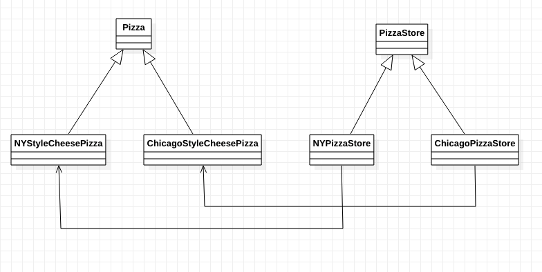

[TOC]

# 工厂方法模式-Java代码示例
* 类图

* 示例描述：
    * pizza发展开加盟店；
    * 纽约的店负责制作符合纽约口味的披萨（一个店可以制作多种披萨）；
    * 芝加哥的店负责制作符合芝加哥口味的披萨（一个店可以制作多种披萨）；
    * 为保证口碑，要统一制作流程。

## 1. 文件列表
* Pizza.java：披萨抽象类，定义统一的披萨接口。（产品）
* NYStyleCheesePizza.java: 纽约风格的芝士披萨。（具体产品A）
* ChicagoStyleCheesePizza.java: 芝加哥风格的芝士披萨。（具体产品B）
* PizzaStore.java: 披萨店抽象类，定义统一的披萨店接口。（创建者、工厂）
* NYPizzaStore.java: 纽约的披萨店。（具体创建者）
* ChicagoPizzaStore.java: 芝加哥的披萨店。（具体创建者）

## 2. 各个文件关键代码
* Pizza.java
```java
public abstract class Pizza {
    String name;
    String dough;
    String sauce;
    ArrayList<String> toppings = new ArrayList<String>();

    void prepare() {
        System.out.println("Preparing " + name);
        System.out.println("Tossing dough...");
        System.out.println("Adding sauce...");
        System.out.println("Adding toppings: ");
        for (int i = 0; i < toppings.size(); i++) {
            System.out.println("    " + toppings.get(i));
        }
    }

    void bake() {
        System.out.println("Bake for 25 minutes at 350");
    }

    void cut() {
        System.out.println("cutting the pizza into diagonal slices");
    }

    void box() {
        System.out.println("Place pizza in official PizzaStore box");
    }

    public String getName() {
        return name;
    }
}
```

* NYStyleCheesePizza.java
```java
public class NYStyleCheesePizza extends Pizza {
    public NYStyleCheesePizza() {
        name = "NY Style sauce and Cheese Pizza";
        dough = "Thin Crust Dough";
        sauce = "Marinara Sauce";

        toppings.add("NY toppings.add 1");
        toppings.add("NY toppings.add 2");
    }
}
```

* ChicagoStyleCheesePizza.java
```java
public class ChicagoStyleCheesePizza extends Pizza {
    public ChicagoStyleCheesePizza() {
        name = "Chicago Style sauce and Cheese Pizza";
        dough = "Thin Crust Dough";
        sauce = "Marinara Sauce";

        toppings.add("Chicago toppings.add 1");
        toppings.add("Chicago toppings.add 2");
        toppings.add("Chicago toppings.add 3");
    }
}
```

* PizzaStore.java
```java
public abstract class PizzaStore {
    abstract Pizza createPizza(String type);

    public Pizza orderPizza(String type) {
        Pizza pizza;

        pizza = createPizza(type);

        pizza.prepare();
        pizza.bake();
        pizza.cut();
        pizza.box();

        return pizza;
    }
}
```

* NYPizzaStore.java
可以创建多种披萨，这里只实现一种。
```java
public class NYPizzaStore extends PizzaStore {
    Pizza createPizza(String type) {

        if (type.equals("cheese")) {
            return new NYStyleCheesePizza();
        } else if (type.equals("peperoni")) {
            //return new NYStylePeperoniePizza();
        } else if (type.equals("clam")) {
            //return new NYStyleClamPizza();
        } else if (type.equals("veggie")) {
            //return new NYStyleVeggiePizza();
        }

        return null;
    }
}
```

* ChicagoPizzaStore.java
可以创建多种披萨，这里只实现一种。
```java
public class ChicagoPizzaStore extends PizzaStore {
    Pizza createPizza(String type) {

        if (type.equals("cheese")) {
            return new ChicagoStyleCheesePizza();
        } else if (type.equals("peperoni")) {
            //return new ChicagoStylePeperoniePizza();
        } else if (type.equals("clam")) {
            //return new ChicagoStyleClamPizza();
        } else if (type.equals("veggie")) {
            //return new ChicagoStyleVeggiePizza();
        }

        return null;
    }
}
```

## x. 疑问

## y. 拓展/总结

## z. 参考
* 《Head First设计模式》

