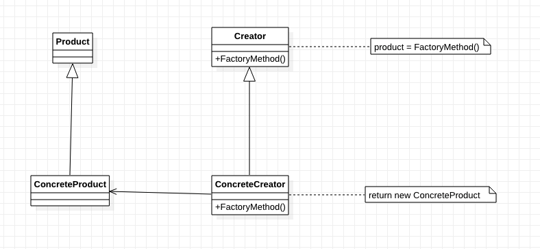
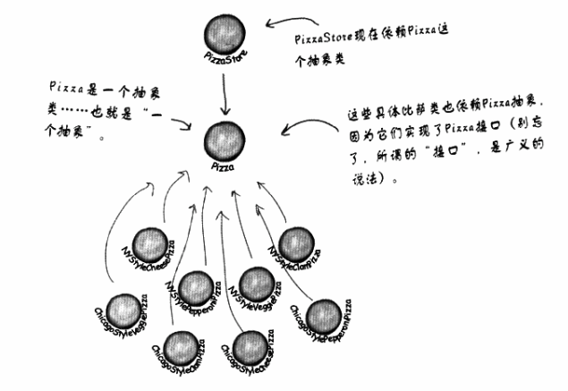

[TOC]

# 工厂方法
工厂方法模式(Factory Method Pattern)又称为：
* 工厂模式；
* 虚拟构造器(Virtual Constructor)模式
* 多态工厂(Polymorphic Factory)模式
它属于类创建型模式。

## 1. 基础概念
* 定义/意图：
    * 定义一个创建对象的接口，让子类决定实例化哪一个类。
    * 工厂方法使一个类的实例化延迟到其子类。
    * 框架使用抽象类定义和维护对象之间的关系。

* 类图：

* 出场嘉宾
    * 产品/Product: 定义产品。
    * 具体产品/Concrete Product: 定义具体的产品，继承自产品。
    * 创建者/Creator：工厂；工厂的抽象类，声明工厂方法。
        * 创建者可以定义一个默认的缺省实现，返回一个缺省的具体产品。
    * 具体创建者/Concrete Creator: 具体工厂；继承自工厂，用于创建具体产品。

## 2. 解决什么问题？如何解决？

## 3. 优缺点是什么？
### 3.1 优点
* 【简单工厂的优点】
* 将创建对象的代码集中在一个对象或一个方法中，避免重复代码。
* 实例化对象时，依赖接口，不依赖具体类。【？！】
* 添加新产品时，不需修改旧代码，只需添加新的具体产品和具体创建者。

### 3.2 缺点
* 必须创建创建者的子类，无论用户想创建的具体产品是一个还是多个。（成对添加）

## 4. 使用场景是什么？
* 当一个类不知道它所创建的对象的类的时候。
* 当一个类希望由它的子类来指定所创建的对象的时候。
* 当类将创建对象的职责委托给一个或多个子类，并且将这些子类(代理者)是代理者这一信息局部化的时候。

## 5. 注意
* 工厂方法模式主要有两种不同情况：
    * 1）Creator类是一个抽象类，并且不提供工厂方法的实现。
    * 2）Creator类是具体类，并且提供工厂方法的一个缺省实现。
    
* 参数化工厂方法：一个工厂方法可以创建多种产品。
* 特定语言的变化和问题。【？！】
* C++中，工厂方法通常是需函数并且是纯虚函数。
* 在Creator的构造器中不要调用工厂方法——在具体Concrete Creator中该方法还不可以。【？！】
* 使用模板以避免创建子类。（解决第一个缺点）【？！】
* 进行命名约定。

## 6. 应用实例？
* 日志记录器：同时支持多种日志记录方式，如文件记录、数据库记录等。

## x. 疑问
* 工厂方法(Factory Method)和创建者(Creator)是否总是抽象的？
    * 不。可以定义一个默认的工厂方法来产生具体产品。这样一来，即使没有具体创建者，也可以创建产品。
* 工厂方法模式和简单工厂模式的区别？
* C++中，模板如何使用？
* 什么是依赖倒置原则？
    * 依赖倒置原则：要依赖抽象，不要依赖具体的类。
    * 这个原则说明了：不能让高层组件依赖低层组件，而且，不管是高层还是低层组件，都应该依赖抽象。
    * 示例：
        
        * Pizza是一个抽象
        * PizzaStore(高层组件)和XXXStylePizza(低层组件)都依赖Pizza(抽象)，而不是高层组件直接依赖低层组件。
* 如何避免违反依赖倒置原则？
    * 变量不可以持有具体类的引用。
        * 如果使用new，就会持有具体类的引用，可以用工厂来避开。
    * 不要让类派生自具体类，应派生自一个抽象（接口）
        * 如果派生自具体类，就会依赖具体类。
    * 不要覆盖基类中已实现的方法。
        * 如果覆盖，说明基类不是真正适合被继承的抽象。基类中已实现的方法，应所有子类共享。

## y. 拓展
* C++模板
* 使用多个工厂方法：抽象工厂中定义多个工厂方法。
* 对象复用：具体创建者把创建的对象保存下来，下次创建的时候先查询，如果没有再创建。
    * 只适合某些对象可以复用的情况。

## z. 参考
* 《Head First设计模式》 p118

