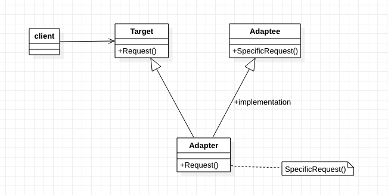
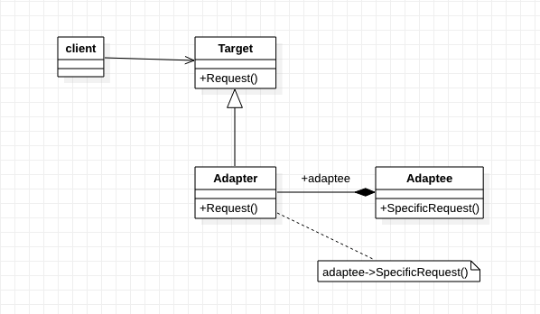
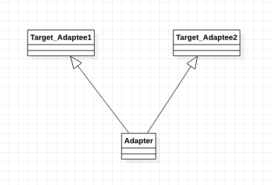

[TOC]

# 适配器模式——将一个接口转换成另一个接口
* 目标：
    * 初接触此模式时，熟悉最常用的使用方式。如，对象适配器。
    * 有更深的理解后，再研究其他使用方法。如，类适配器和双向适配器
## 1. 基础概念
* 定义/意图：
    * 将一个类的接口转换成另一个接口。适配器(Adapter)模式使得原来接口不兼容的类可以一起工作。
    * 把一个东西，伪装成另一个东西！
* 别名：包装器（Wrapper）
* 类图1：类适配器类图（使用多重继承对一个接口与另一个接口进行匹配）

* 类图2：对象适配器类图

* 出场嘉宾
    * Target: 定义Client使用的与特定领域相关的接口。
    * Client：与符合Target接口的对象协同。
    * Adaptee：已存在的接口，被适配者。
    * Adapter：对Adaptee接口与Target接口进行适配，适配器。
* 协作/工作流程
    * Client在Adapter实例上调用一些操作。
    * Adapter调用Adaptee的操作，以实现用户请求。

## 2. 解决什么问题？如何解决？
* 在不改变原有Target和Adaptee代码情况下，对Adaptee用Target的方式访问。
* 解决方法：在两者之间添加一个中间层——Adapter。

## 3. 优缺点是什么？
### 3.1 类适配器的优点
* 不需要重新实现整个`被适配者`类只实现部分，因为Adapter是Adaptee的子类。
* 仅引入了一个对象，不需要额外的指针间接得到adaptee。

### 3.2 类适配器的缺点
* 只能适配某个特定的类，不能适配其子类。【疑惑？！】

### 3.3 对象适配器的优点
* 更有弹性，使用组合（引用另一个类或其子类），支持适配某个类及其子类。

### 3.4 对象适配器的缺点
* 重定义(新增)Adaptee`子类`的行为变得比较困难。解决方法：直接引用`子类`对象。

## 4. 使用场景是什么？
* 希望使用一个`已存在`的类，但是它的接口不符合要求。
* 想要创建一个可以复用的类，该类可以与其他不想管的类或不可预见的类（接口不一定兼容）协同工作。【？？？】
* （仅适用于对象适配器）想要使用一些已经存在的`子类`，但不可能对每个子类都进行类似的匹配。对象适配器可以适配它的父类接口。【？？？】

## 5. 注意
* 使用适配器模式时需要考虑的其他一些因素：
    * Adapter的匹配程度。
        * `适配器的工作量`取决于Target接口与Adaptee接口的相似程度。
    * 可插入的Adapter。【不理解？？？】
        * 将接口匹配【？？？】构建为一个类，就不需要嘉定对其他的类可见的是一个`相同`的接口。
        * 接口匹配使得我们可以将自己的类加入到一些现有的系统中去。
    * 使用双向适配器提供透明操作【？？？】
        * 当`两个不同的客户`需要用不同的方式查看`同一个对象`时，双向适配器尤其有用。
        * 
            * Adapter是两个类的子类，使得两个两个类的相关接口可以相互匹配。【疑惑？？？】
            * 有更深理解后，在图里各个类中加入相关操作，以更清楚表达意图。
* 使用适配器的一个潜在问题是：他们不对所有的客户都透明。
* 实现时，需要注意以下的一些问题：
    * 使用C++实现适配器类时，Adapter类应该用`公共方式`继承Target类、用`私有方法`继承Adaptee类。
        * 因此，Adapter类应该是Target类的子类型，但不是Adaptee类的子类型。
    * 可插入的适配器。以书本中示例有三种实现方法：（具体见：《设计模式》95页）
        * 使用抽象操作。【？？？】
        * 使用代理对象。【？？？】
        * 参数化的适配器。【？？？】
## 6. 应用实例？
* 

## w. 待办
* (DONE!)对象适配器——C++示例
* (DONE!)对象适配器-Java示例
* 类适配器——C++示例
* 类适配器——Java示例

## x. 疑问
* 程序透明性？
* 双向适配器？
* 可插入的适配器？

## y. 拓展
* 桥接模式(Bridge)和对象适配器(Adapter)的结构类似，但是出发点不同。
    * 桥接模式(Bridge): 将接口部分和实现部分分离，从而对他们可以较为容易地相对独立的加以改变。
    * 对象适配器(Adapter): 把一个对象行为变为另一个。
* 相关模式：
    * 桥接模式(Bridge)
    * 装饰者模式(Decorator): 增强对象的功能但不改变原有对象的接口。（因此，程序透明性比适配器好）
    * 代理模式(Proxy): 不改变接口情况下，为另一个对象定义一个代理。

## z. 参考
* 《设计模式：可复用面向对象软件的基础》
* 《Head First设计模式》

