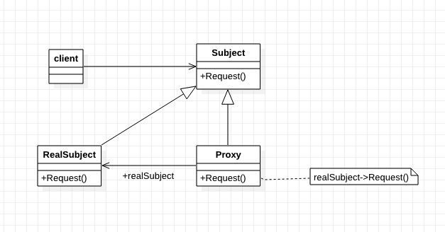
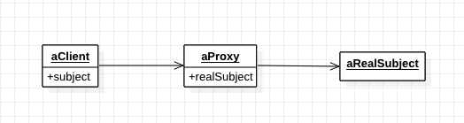

[TOC]

# 代理模式
* 目标：
    * 初接触此模式时，熟悉最常用的使用方式。
    * 有更深的理解后，再研究其他使用方法。
## 1. 基础概念
* 定义/意图：为某个对象提供一种代理，以控制对这个对象的访问。
    * 控制对象的访问；只有需要时才创建、初始化。
* 别名：Proxy，Surrogate`[ˈsɜ:rəgət]`
* 类图：

* 可能的对象图

* 出场嘉宾
    * Subject: 
        * 定义 RealSubject 和 Proxy 的共用接口。使得可以在任何使用 RealSubject 的地方使用 Proxy。
    * Proxy: 代理。继承自 Subject。
        * 保存 RealSubject 的引用。
        * 提供与 RealSubject 相同的接口，以代替 RealSubject。
        * 控制对 RealSubject 的存取/访问，并可能负责创建、删除。
        * 针对类型的功能：
            * 远程代理：负责对请求及参数进行编码，编发送给不同地址空间的实体。
            * 虚拟代理：可缓存真实对象的附加信息，以延迟对真实对象的访问/创建。如，图片代理缓存图片的大小，尺寸。
            * 保护代理：检查调用者的权限，保护真实对象。
    * RealSubject: 
        * 真实的对象，被 Proxy 代表的实体。
    * Client: 
        * 使用 Subject。

* 协作/工作流程
    * Client 向 Proxy 进行请求。
    * Proxy 进行相关附加操作后，对请求进行转发或其他操作。

## 2. 优缺点是什么？
### 2.1 优点
* 可以隐藏被代理对象不再同一地址空间的事实。
* 可以最优化，根据要求创建对象 (管理对象)。
* 可以对被代理对象进行保护。
* 可以对被访问对象进行一些额外/附加操作。

### 2.2 缺点
* 代码调用层次加深，复杂度更高。

## 3. 使用场景是什么？
* 在需要用比较通用和复杂的对象指针代替简单的指针的时候，使用 Proxy 模式。
* 使用代理模式的常见情况：
    * 远程代理：为一个对象在不同的地址空间提供`局部代表`。
    * 虚拟代理：根据需要创建开销很大的对象。一些已知的东西由代理进行提供，只有最必须时，才进行目标对象创建。
    * 保护代理：控制对原始对象的访问，提供访问保护。
    * 智能指引：取代简单指针，访问对象时，执行一些附加操作。典型用途：
        * 对指向的实际对象引用计数，当对象没有引用时，自动释放对象。（也称为智能指针/Smart Pointers）
        * 第一次引用一个持久对象时，将它装入内存。【持久化对象？？？】
        * 访问实际对象前，检查是否锁定，以确保其他对象不能修改它。

## 4. 注意
* 实现注意：
    * Proxy 并不总是需要知道 RealSubject 的类型。
        * 如果 Proxy`类`能通过一个抽象接口处理它的实体，则无需为每一个 RealSubject`类`都生成一个 Proxy`类`；Proxy 可以统一处理所有 RealSubject 类。
        * 如果 Proxy 要实例化 RealSubject，则必须知道具体的类。

## 5. 应用实例？
* 

## w. 待办
* 

## x. 疑问
* 

## y. 拓展
* 

## z. 参考
* 《设计模式：可复用面向对象软件的基础》
* 《Head First 设计模式》

