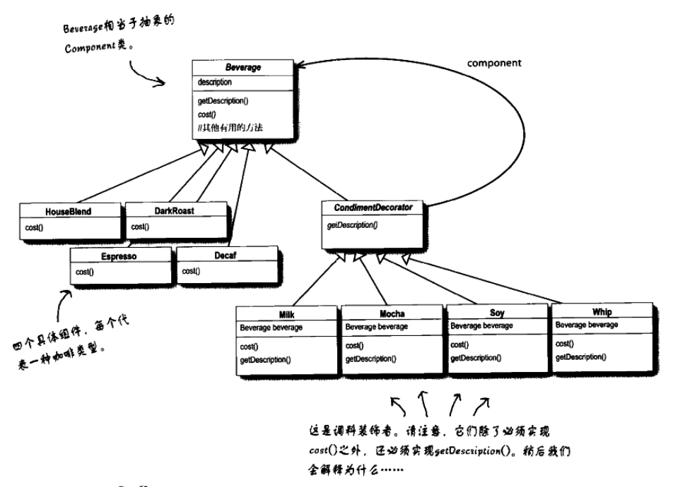

[TOC]

# 装饰者模式-Java 代码示例
* 这个例子是《Head First 设计模式》上面的例子
* 类图


## 1. 文件列表及功能
* Beverage.java: 组件/被装饰者，抽象类，用于定义具体组件的接口。其他类的公共类。
* CondimentDecorator.java: 装饰者，抽象类，用于定义具体装饰者的接口。
* DarkRoast.java: 以下 4 个是具体组件/被装饰者。
* Decaf.java: 
* Espresso.java:
* HouseBlend.java:
* Milk.java: 以下 4 个是具体装饰者。
* Mocha.java:
* Soy.java:
* Whip.java:
* StarbuzzCoffee.java: 测试代码，主函数。

## 2. 各个文件关键代码
### 2.1 组件抽象类
* Beverage.java
> 个人感觉 getDescription() 在这个例子里面有一定干扰作用。
> CondimentDecorator 里面的 getDescription() 是抽象的。
```java
public abstract class Beverage {
    String description = "Unknown Beverage";

    public String getDescription() {
        return description;
    }

    public abstract double cost();
}
```

### 2.2 装饰者抽象类
* CondimentDecorator.java
```java
public abstract class CondimentDecorator extends Beverage {
    public abstract String getDescription();
}
```

### 2.3 具体组件类
* DarkRoast.java
> 其他几个类似
```java
// 具体基础组件
public class DarkRoast extends Beverage {
    public DarkRoast() {
        description = "DarkRoast";
    }

    public double cost() {
        return 1.29;
    }
}
```

### 2.4 具体装饰者类
* Milk.java
> 其他几个类似
```java
// 具体修饰者类
public class Milk extends CondimentDecorator {
    Beverage beverage;  // 保存被修饰的对象

    public Milk(Beverage beverage) {
        this.beverage = beverage;
    }

    public String getDescription() {
        return beverage.getDescription() + ", Milk";
    }

    public double cost() {
        return beverage.cost() + 0.40;
    }
}
```

### 2.5 测试代码
* StarbuzzCoffee.java
```java
public class StarbuzzCoffee {
    public static void main(String args[]) {
        Beverage beverage = new Espresso();
        System.out.println(beverage.getDescription() + " ￥" + beverage.cost());

        Beverage beverage1 = new HouseBlend();
        beverage1 = new Mocha(beverage1);
        beverage1 = new Mocha(beverage1);
        beverage1 = new Whip(beverage1);
        beverage1 = new Soy(beverage1);
        beverage1 = new Milk(beverage1);
        System.out.println(beverage1.getDescription() + " ￥" + beverage1.cost());

        Beverage beverage2 = new DarkRoast();
        beverage2 = new Mocha(beverage2);
        beverage2 = new Mocha(beverage2);
        beverage2 = new Whip(beverage2);
        beverage2 = new Soy(beverage2);
        beverage2 = new Milk(beverage2);
        System.out.println(beverage2.getDescription() + " ￥" + beverage2.cost());

        Beverage beverage3 = new Decaf();
        beverage3 = new Mocha(beverage3);
        beverage3 = new Whip(beverage3);
        beverage3 = new Soy(beverage3);
        beverage3 = new Milk(beverage3);
        System.out.println(beverage3.getDescription() + " ￥" + beverage3.cost());
    }
}
```

## x. 疑问
* getDescription() 是否有更好的用法？这里是不是有割裂感？

## y. 拓展/总结
* 抽象类就是不能使用 new 方法进行实例化的类，即没有具体实例对象的类。
* 子类继承抽象类时:(注意下面是`祖宗类`, 不是父类)
    * A. 子类声明为抽象类：部分实现或完全不实现`祖宗类`的所有抽象方法；
    * B. 子类不声明为抽象类：实现`祖宗类`所有的抽象方法。
* 抽象方法必须为 public 或者 protected。

## z. 参考
* [抽象类/抽象方法](http://www.runoob.com/java/java-abstraction.html)
* [Java 抽象类、抽象方法](https://www.jianshu.com/p/0530e14192b4)
* [java 抽象类和抽象方法](https://blog.csdn.net/tsuliuchao/article/details/5423026)
