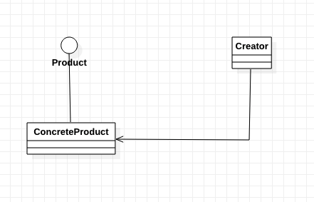

[TOC]

# 简单工厂模式
* 别称：静态工厂方法
* 简单工厂并不是一种模式，而是一种编程习惯。——《Head First 设计模式》
* 代码比较简单，就不写代码的 Readme 了

## 1. 基础概念
* 定义/意图：无
* 类图：

* 出场嘉宾
    * 产品/Product：产品，抽象类（或接口）
    * 具体产品/Concrete Product：具体产品，继承/实现 Product
    * 工厂/Creator：工厂，用于生产 Product

## 2. 解决什么问题？如何解决？
无

## 3. 优缺点是什么？
### 3.1 优点
* 把变化集中到一块，易于管理。
* "消费对象"不需要直接创建具体产品 (Concrete Product)，把对象创建和使用分开。

### 3.2 缺点
* 工厂类集中了多个其他类，违反了高内聚责任分配原则。【？！】
* 有新的`具体产品`时，需要修改代码，不符合开闭原则。
* 随着`具体产品`增加，判断添加回变多，维护回变难。

> 这些缺点在`工厂方法模式`中得到解决。

## 4. 使用场景是什么？
* 工厂类负责创建的对象固定、较小。（变动不频繁）
* 对创建对象的逻辑不关心。

## 5. 注意
* 由于简单工厂模式容易违反高内聚责任分配原则，因此一般只在较简单的情况下应用。

## 6. 应用实例？
* 无

## x. 疑问
* 

## y. 拓展
* 工厂方法模式
* 抽象工厂模式

## z. 参考
* 《Head First 设计模式》

