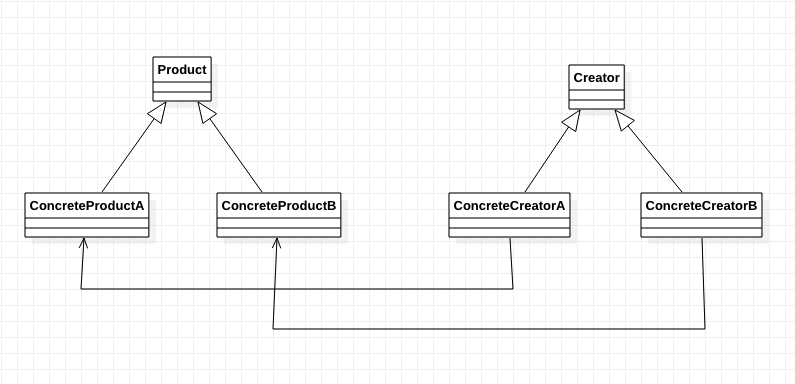

[TOC]

# 工厂方法模式-C++ 代码示例
* 类图


## 1. 文件列表
* Product.h: 产品抽象类，定义产品的接口。
* ConcreteProductA.h/cpp:
* ConcreteProductB.h/cpp:

* Creator.h: 创建者/工厂抽象类，定义创建者的接口。
* ConcreteCreatorA.h/cpp: 具体的创建者，主要用来创建 ConcreteProductA。（产品 A 可以是一类，而不知一个）
* ConcreteCreatorB.h/cpp: 具体的创建者，主要用来创建 ConcreteProductB。（产品 B 类似产品 A）
* main.cpp: 测试程序入口函数。
* run.sh: 运行的脚本。

## 2. 各个文件关键代码
### 2.1 产品
* Product.h
```cpp
class Product {
public:
    virtual ~Product() {};
    virtual std::string getName() = 0;
};
```

* ConcreteProductA.h/cpp
```cpp
// .h

class ConcreteProductA : public Product {
public:
    ConcreteProductA();
    std::string getName();
private:
    std::string _name;
};

// .cpp
ConcreteProductA::ConcreteProductA() {
    _name = "ConcreteProductA";
}

std::string ConcreteProductA::getName() {
    return _name;
}
```

* ConcreteProductB.h/cpp
```cpp
// .h

class ConcreteProductB : public Product {
public:
    ConcreteProductB();
    std::string getName();
private:
    std::string _name;
};

// .cpp
ConcreteProductA::ConcreteProductB() {
    _name = "ConcreteProductB";
}

std::string ConcreteProductB::getName() {
    return _name;
}
```

### 2.2 创建者/工厂

* Creator.h
```cpp
class Creator {
public:
    virtual ~Creator() {};
    virtual Product *createProduct(int type) = 0;
};
```


* ConcreteCreatorA.h/cpp
```cpp
// .h
class ConcreteCreatorA : public Creator {
public:
    Product* createProduct(int type);
};

// .cpp
Product* ConcreteCreatorA::createProduct(int type)
{
    if (type == 'A') {
        return new ConcreteProductA();
    }

    return NULL;
}
```


* ConcreteCreatorB.h/cpp
```cpp
// .h
class ConcreteCreatorB : public Creator {
public:
    Product* createProduct(int type);
};

// .cpp
Product* ConcreteCreatorB::createProduct(int type)
{
    if (type == 'B') {
        return new ConcreteProductB();
    }

    return NULL;
}
```

### 2.3 测试/调试
* main.cpp: 测试程序入口函数。
```cpp
int main()
{
    ConcreteCreatorA cca;
    ConcreteCreatorB ccb;

    Product *product = cca.createProduct('A');
    std::cout << product->getName() << std::endl;
    delete product;
    product = NULL;

    product = ccb.createProduct('B');
    std::cout << product->getName() << std::endl;
    delete product;
    product = NULL;

    return 0;
}
```

## x. 疑问

## y. 拓展/总结

## z. 参考
* 无

