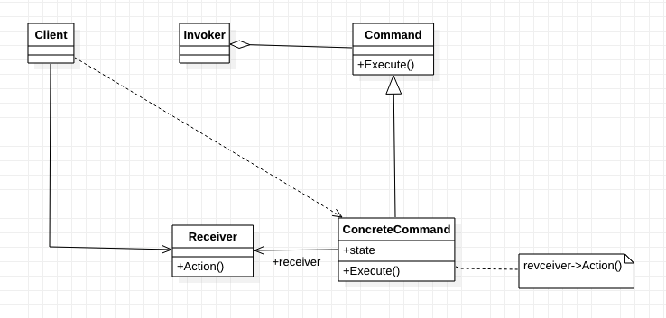

[TOC]

# 命令模式
## 1. 基础概念
* 定义/意图：
    * 将请求封装成对象，从而支持用不同的请求对客户进行参数化、对请求排队、记录请求日志，以及支持可撤销的操作。
    * 命令模式是回调机制的一个面向对象的替代品。
* 类图：

* 出场嘉宾
    * Command: 命令，抽象类，声明执行操作的接口。
    * ConcreteCommand: 具体命令；
        * 将一个 Receiver 对象绑定于一个动作；
        * 调用接收者相应的操作，以实现 Execute。
    * Client: 客户，创建一个 ConcreteCommand，并设定 Receiver.
    * Invoker: 触发者，触发命令执行。
    * Receiver: 接收者，实际的动作执行者。
* 协作流程
    * `Client`创建一个`ConcreteCommand`对象并指定它的`Receiver`对象。
    * 某`Invoker`对象存储`ConcreteCommand`对象。
    * 该`Invoker`对象调用`Command`对象的 Execute 操作来提交请求。
    * `ConcreteCommand`调用它的`Receiver`对象的一些操作，以执行请求。

## 2. 解决什么问题？如何解决？

## 3. 优缺点是什么？
### 3.1 优点
* 将调用操作的对象 (Invoker?) 与知道如何实现该操作的对象 (Receiver?) 解耦。
* 易于添加新的 Command。
* 易于将多个 Command 装配成一个复合命令。

### 3.2 缺点
* 

## 4. 使用场景是什么？
* 当需要把待执行的动作抽象出来，参数化给某对象时。
* 在不同时刻指定、排列和执行请求。
* 支持取消/撤销操作。
    * 将操作前的状态保存起来，取消操作时，用此状态来消除操作的影响。
    * 进行逆操作应该也是一种方法。
* 支持操作日志（修改日志）。（提供加/装载和存储操作）
    * 当系统奔溃时，可以根据日志重新将操作做一遍，来恢复奔溃前的状态。
* 用构建在原语操作上的高层操作构造一个系统。【？！】

## 5. 注意——实现时需要考虑的问题
* 一个命令对象应具备何种智能程度。两个极端：
    * 进确定接收者和执行该请求的动作。
    * 实现所有功能，不需要接收者。
* 支持取消 (undo)/和重做 (redo)，见拓展。
* 避免取消操作过程中的错误积累。
    * 在实现一个可靠地、能保持原先语义的取消/重做机制时，可能会遇到`滞后影响`的问题。【？！】
* 考虑使用 C++ 模板；对（1.不能被取消; 2.不需要参数）的命令，可以考虑使用模板。
    * 可以避免为每一种动作和接收者都创建一个 Command 子类。

## 6. 应用实例？
* Aria2——一个下载工具

## w. 待办
* Java 第二个示例：使用队列等结构，组织执行多个命令。

## x. 疑问
* 4.5 不懂！
* 滞后影响？

## y. 拓展
* 支持取消 (undo)/和重做 (redo)：提供逆转 (reverse) 的方法，如 Unexecute/Undo/Redo。可能需要存储额外的信息：
    * 接收者对象，真正的执行者。
    * 接收者上执行操作的参数。（接收者可能需要）
    * Execute 时会改变的值。（保存或 Undo 的时候恢复。）

## z. 参考
* 

