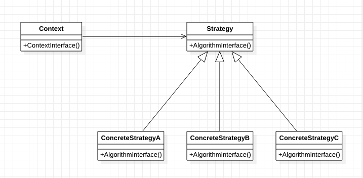

[TOC]

# 策略模式——用委托改变算法
* 目标：
    * 初接触此模式时，熟悉最常用的使用方式。
    * 有更深的理解后，再研究其他使用方法。
## 1. 基础概念
* 定义/意图：
    * 定义一系列算法，把它们一个个封装起来，并使它们可以相互替换。
    * 本模式使得算法可以独立于使用它的客户而变化。
* 别名：Policy（政策）
* 类图：

* 出场嘉宾
    * Strategy：策略，定义算法的公共接口。
        * Context使用这个接口来调用某个ConcreteStrategy定义的算法。
    * ConcreteStrategy：具体策略，实现具体的算法。
    * Context：上下文
        * 用已成而ConcreteStrategy对象来配置；【？？？】
        * 维护一个对Strategy对象的引用；
        * 可定义一个接口来让Strategy访问它的数据。
* 协作/工作流程
    * Strategy和Context相互作用，以实现选定的算法。
        * Context将算法需要的参数传给Strategy，或
        * Context将自己作为参数传给Strategy。
    * Context将它的客户的请求转发给它的Strategy。
        * 客户通常创建并传递一个ConcreteStrategy对象给该Context（客户仅与Context交互）。
        * 客户通常可以选择一系列的ConcreteStrategy。

## 2. 优缺点是什么？
### 2.1 优点
* Strategy类层次为Context定义了一系列可供重用的算法/行为。
* 提供一个代替继承的方法。
    * 继承提供了另一种支持多种算法/行为的方法——直接生成Context的子类，但提供不同的行为。
* 消除了一些条件语句（客户进行指定，不需要switch和if）
* 可提供相同行为的不同实现。


### 2.2 缺点
* 客户必须了解各种ConcreteStrategy。
* Strategy和Context之间的通信开销——某些ConcreteStrategy可能永远用不上某些参数。
* 增加了对象的数目。
* 


## 3. 使用场景是什么？
* 许多相关的类仅仅是行为异。"策略"提供了一种用多个行为中的一个来配置一个类的方法。
* 需要使用一个算法的不同变体。
* 算法使用客户端不应该知道的数据。
* 一个类定义类多种行为，并且这些行为在这个类的操作中已多个条件语句的形式出现。
    * 将相关的条件分支移入它们各自的Strategy类中以代替这些条件语句。


## 4. 注意
* 需要考虑的实现问题：
    * Strategy和Context接口必须使得ConcreteStrategy能够有效访问它所需要的Context中的任何数据。
        * 方法一：Context将数据作为参数传递给Strategy
            * 缺点：Context可能发送一些Stratege不需要的数据。
            * 优点：Context和Strategy解耦。
        * 方法二：Context将自身作为参数传递给Strategy，Strategy再显式想Context请求数据或者存储Context的一个引用（这样就根本不需要再传递任何东西）
            * 缺点：Context和Strategy紧密耦合。
            * 优点：传递数据少。
    * 使Strategy对象成为可选的。
        * 如果想要不使用额外的Strategy对象的情况下，Context仍有意义的话，可以：
            * 访问某个Strategy对象前，先检查是否存在，存在就使用，不存在就使用默认（缺省）的行为。
            * 优点：用户只在需要时，才需要了解ConcreteStrategy对象。
    * C++中，只有满足下面的条件才能将Strategy作为`模板参数`：
        * 1.可以在编译时选择Strategy；
        * 2.它不需要在运行时改变
        * 示例：
        ```cpp
        // Context
        template <class AStrategy>
        class Context {
            void Operation() {
                theStrategy.DoAlgorithm();
            }
        private:
            AStrategy theStrategy;
        }
        
        // Strategy
        class MyStrategy {
            public:
                void DoAlgorithm();
        }
        
        Context<MyStrategy> aContext;
        ```

## 5. 应用实例？
* 

## w. 待办
* 

## x. 疑问
* 

## y. 拓展
* 

## z. 参考
* 《设计模式：可复用面向对象软件的基础》
* 《Head First设计模式》

