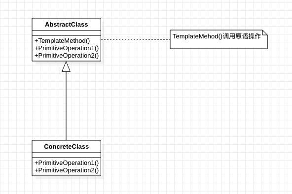

[TOC]

# 模板方法模式
* 目标：
    * 
## 1. 基础概念
* 定义/意图：定义一个操作的算法的`骨架`，将一些步骤延迟到子类中。模板方法模式使得子类可以不改变一个算法的结构即可重定义该算法的某些特定步骤。
* 别名：无
* 类图：

* 出场嘉宾
    * AbstrackClass：抽象类
        * 定义抽象的`原语操作(primitive operation)`，各个步骤的具体实现交给子类。
        * 实现一个模板方法，定义一个算法的步骤。
        * 实现不变的部分。
    * ConcreteClass：具体类
        * 实现原语操作，完成特定步骤的具体实现。
        * 实现变动的部分。
* 协作/工作流程
    * AbstrackClass实现不变的部分（或骨架）；
    * ConcreteClass实现变动的部分；
    * AbstrackClass 和 ConcreteClass 实现整个操作/算法。
* 效果
    * 模板方法是一种`代码复用`的`基本技术`。在类库中尤为重要。
    * 模板方法导致一种反向的控制结构——"好莱坞原则"——即"别找我们，我们会找你"——父类调用子类的操作。
    * 模板方法可能调用下列类型的操作：
        * 具体的操作：ConcreteClass或对客户类的操作。
        * 具体的AbstractClass的操作：即通常对子类有用的操作。
        * 原语操作：即抽象操作
        * 工厂方法
        * 钩子操作(hook operation)：提供缺省的行为，子类可在必要时进行扩展。

## 2. 优缺点是什么？
### 2.1 优点
* 提供更好的扩展性；
* 减少重复代码。

### 2.2 缺点
* 每个算法都要定义一个子类。

## 3. 使用场景是什么？
* 一个算法，多数操作相同，少数不同。
    * 一次性实现一个算法不变的部分，并将可变的行为留给子类来实现。
    * 子类中公共行为应该被提取到父类中，避免代码重复。
* 需要控制子类扩展。在某些特定点调用"hook"操作，允许在这些点进行扩展。

## 4. 注意
* 需要注意的实现问题：
    * 使用访问控制。
        * C++中，模板方法调用的原语操作可以被定义为保护成员，保证它们只被模板方法调用
        * C++中，必须重定义的原语操作需定义为纯虚函数。（重定义：父类提供接口，子类实现。）
        * C++中，模板方法不需重定义，不需定义为纯虚函数。
    * 尽量减少原语操作。
        * 减少子类需要重定义的原语操作。原语操作越多，子类实现越冗长。
    * 命名约定：给应被重定义的操作加上`特定前缀`。

## 5. 应用实例？
* 

## w. 待办
* 

## x. 疑问
* 策略模式使用`委托`，委托是指？ConcreteStrategy委托给Context？

## y. 拓展
* 相关模式：
    * 工厂模式：可被模板方法调用。
    * 策略模式：使用`委托`来改变整个算法。（模板方法使用`继承`来改变算法的一部分）
        * 委托【？？？】

## z. 参考
* 《设计模式：可复用面向对象软件的基础》
* 《Head First设计模式》

