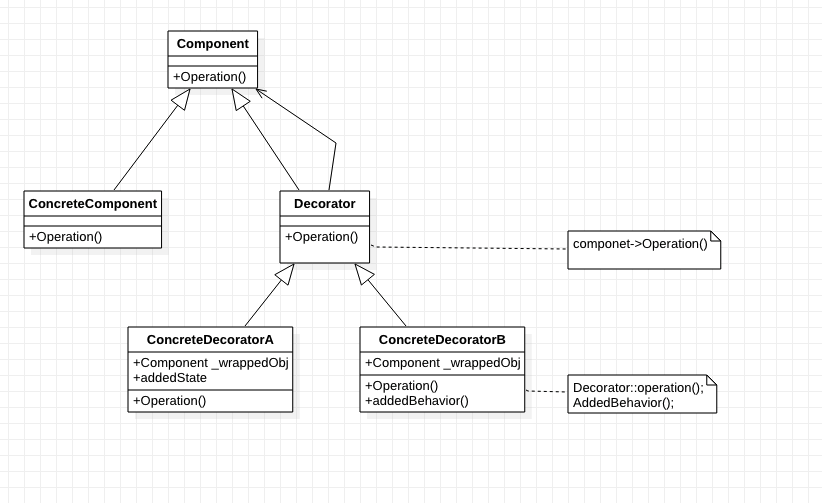

[TOC]

# 装饰者模式——不改变接口，但加入责任
## 1. 基础概念
* 定义：**动态**地给一个**对象**添加一些额外的职责。
    * 注意是针对`对象`而不是`类`

* 类图：

* 出场嘉宾：
    * [基础]组件(Conponent): 被装饰者，定义一个对象接口（Java：接口，C++：抽象类）；
    * 具体[基础]组件(Concrete Conponent): 定义一个具体的基础组件对象，可以给这个对象添加一些职责（装饰该对象）。
    * 装饰者(Decorator): 维持一个指向组件**对象**的指针，并定义一个与组件接口一致的接口。(指针是为了知道所修饰的是什么)
    * 具体装饰者(Concrete Decorator): 可以向具体组件添加职责（修饰）。

## 2. 解决什么问题？如何解决？
* 解决用继承给对象添加功能不够灵活的问题。
    * 通常拓展一个类都是用继承的方法，这是静态拓展，随着拓展增多，子类会膨胀。
* 解决方法：具体组件和修饰者都继承自公共的类，使一个对象能装饰另一个对象。

## 3. 优缺点是什么？
### 3.1 优点
* 拓展功能时，提供比继承更有弹性的解决方案。（可增加、删除职责）
    * 比静态继承更灵活。
* 可通过动态的方式在运行时选择不同的具体装饰类，实现不同的行为。
* 可以对一个对象进行多次修饰（甚至多次相同的修饰）。
* 符合`开闭原则`，具体组件和具体修饰者可以独立变化，用户根据需要添加组件或装饰者，原代码不需修改。
* 装饰者可以在所`委托的装饰者行为`之前或之后加上自己的行为，以达到特定的目的

### 3.2 缺点
* 可能有许多小对象，排错难度加大、代码阅读难度加大。
* 可能不同的东西，继承自一个公共类。（个人理解）

## 4. 使用场景是什么？
* 在不影响其他对象的情况下，已`动态`、`透明`的方式给单个`对象`添加职责。
* 处理那些可以撤销的职责。
    * 怎么实现撤销？？？
* 当不能使用子类/继承的方法进行扩充时。
    * 情况一：类定义被隐藏，因此无法用于生成子类。
    * 情况二：有大量独立的扩展，为支持每一种组合将产生大量子类。（使子类书目爆炸性增长）

## 5. 注意
* 1）接口一致性：必须有一个公共的父类。
* 2）省略抽象的装饰者类：当仅需添加一个职责时，没有必要定义抽象的装饰者类。
* 3）保持组件(Component)类的简单性：
    * 它是公共接口，保持简单很重要；
    * 它应集中定义接口，不应存储数据
    * 赋予太多功能会使子类存在不需要的功能的可能性大大增加。
* 4）改变对象外壳与改变对象内核：可以将Decorator看做是对象的外壳。【内核...: Strategy策略模式】

## 6. 应用实例？
* 星巴兹饮料调配——《Head First设计模式》
* 游戏里面人物捏脸？！
* 单个主体组件+多个其他附属组件 这类的东西（人+衣服、首饰？蛋糕+蜡烛、碟子？）。

## x. 疑问
* 如何实现撤销一个对象的职责/功能？
* 如何优雅地释放内存？（具体装饰者一个一个被new出来，但是如何释放呢？）

## y. 拓展
* 模式简化：
    * 简化方式一：去除组件(Conponent)——只有一个具体组件时，则直接让装饰者继承自这个具体组件。
    * 简化方式二：去除修饰者(Decorator)——只有一个具体修饰者时，则让具体修饰者继承自组件(Conponent)。
* C++编程规则：
    * 在多态基类中，定义析构函数为virtual。
    * 使基类的析构函数为public + virtual或者 protected + nonvirtual；
* 策略模式：？？？

## z. 参考
* 《Head First设计模式》
* 《设计模式：可复用面向对象软件的基础》
* * [虚析构函数](https://www.zhihu.com/question/41538182)
