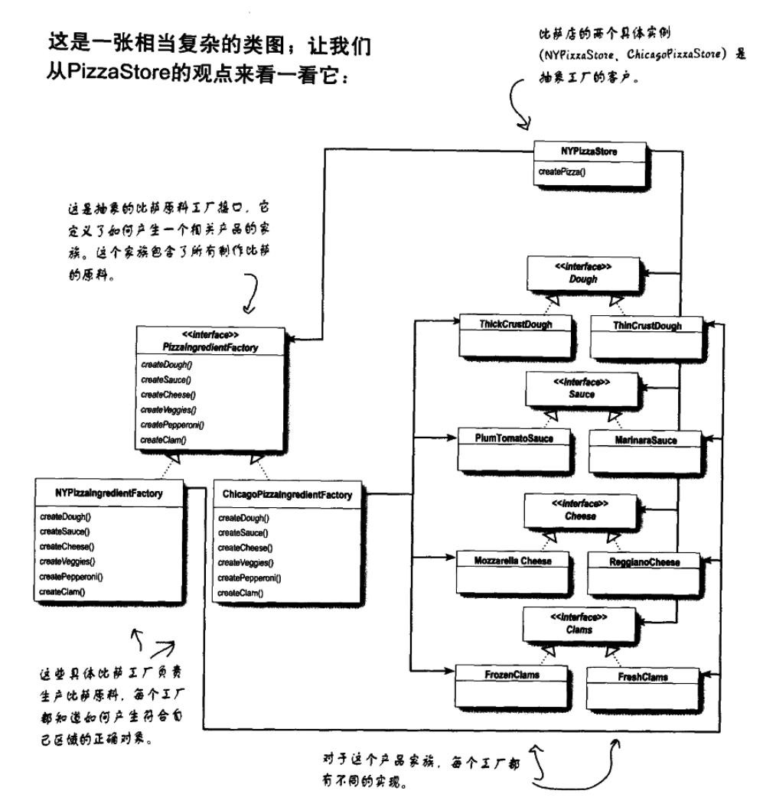

[TOC]

# 抽象工厂模式-Java代码示例
* 类图


## 1. 文件列表
* PizzaIngredientFactory.java: 抽象工厂
* NYPizzaIngredientFactory.java: 具体工厂
* ChicagoPizzaIngredientFactory.java: 具体工厂
* Dough.java: 抽象产品——产品类
* ThickCrustDough.java: 具体产品，Dough的一种
* ThinCrustDough.java: 具体产品，Dough的一种
* Sauce.java: 抽象产品——产品类
* MarinaraSauce.java: 具体产品，sauce的一种
* PlumTomatoSauce.java: 具体产品，sauce的一种

## 2. 各个文件关键代码
### 2.1 抽象工厂
* PizzaIngredientFactory.java
```java
public interface PizzaIngredientFactory {
    public Dough createDough();
    public Sauce createSauce();
    /*
    public Cheese createCheese();
    public Veggies[] createVeggies();
    public Pepperoni createPepperoni();
    public Clams createClam();
    */
}
```

### 2.2 具体工厂
* NYPizzaIngredientFactory.java
```java
public class NYPizzaIngredientFactory implements PizzaIngredientFactory {
    public Dough createDough() {
        return new ThinCrustDough();
    }
    public Sauce createSauce() {
        return new MarinaraSauce();
    }
    //public Cheese createCheese();
    //public Veggies[] createVeggies();
    //public Pepperoni createPepperoni();
    //public Clams createClam();
}
```

* NYPizzaIngredientFactory.java
```java
public class ChicagoPizzaIngredientFactory implements PizzaIngredientFactory {
    public Dough createDough() {
        return new ThickCrustDough();
    }
    public Sauce createSauce() {
        return new PlumTomatoSauce();
    }
    //public Cheese createCheese();
    //public Veggies[] createVeggies();
    //public Pepperoni createPepperoni();
    //public Clams createClam();
}
```

### 2.3 抽象产品
* Dough.java
```java
public interface Dough {
    public String toString();
}
```

* Sauce.java
```java
public interface Sauce {
    public String toString();
}
```

### 2.4 具体产品
* ThickCrustDough.java
```java
public class ThickCrustDough implements Dough {
    public String toString() {
        return "ThickCrustDough";
    }
}
```

* ThinCrustDough.java: 具体产品，Dough的一种
```java
public class ThinCrustDough implements Dough {
    public String toString() {
        return "ThinCrustDough";
    }
}
```

* MarinaraSauce.java: 具体产品，sauce的一种
```java
public class MarinaraSauce implements Sauce {
    public String toString() {
        return "MarinaraSauce";
    }
}
```

* PlumTomatoSauce.java: 具体产品，sauce的一种
```java
public class PlumTomatoSauce implements Sauce {
    public String toString() {
        return "PlumTomatoSauce";
    }
}
```

### 2.5 测试代码
* Test.java
```java
public class Test {
    public static void main(String[] args) {
        // 注意用抽象，不用具体类
        PizzaIngredientFactory nypif = new NYPizzaIngredientFactory();
        PizzaIngredientFactory ccgpif = new ChicagoPizzaIngredientFactory();

        System.out.println(nypif.createDough());
        System.out.println(nypif.createSauce());
        System.out.println(ccgpif.createDough());
        System.out.println(ccgpif.createSauce());
    }
}
```

## x. 疑问

## y. 拓展/总结
* 注意：这个例子并没有全部照搬《Head First设计模式》，把多余的部分去掉了。
    * 因为个人在学习过程中，感觉干扰很大。
    * 如果想看更详细的应用，得去看《Head First设计模式》。
## z. 参考
* 《Head First设计模式》

