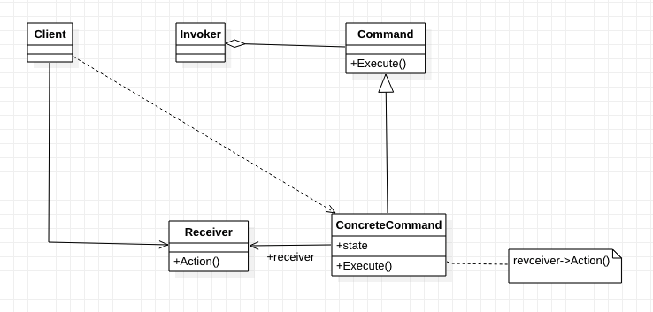

[TOC]

# 命令模式
## 1. 基础概念
* 定义/意图：
    * 将请求封装成对象，从而支持用不同的请求对客户进行参数化、对请求排队、记录请求日志，以及支持可撤销的操作。
    * 命令模式是回调机制的一个面向对象的替代品。
* 类图：

* 出场嘉宾
    * 
* 协作流程

## 2. 解决什么问题？如何解决？

## 3. 优缺点是什么？
### 3.1 优点
* 

### 3.2 缺点
* 

## 4. 使用场景是什么？
* 当需要把待执行的动作抽象出来，参数化给某对象时。
* 在不同时刻指定、排列和执行请求。
* 支持取消/撤销操作。
    * 将操作前的状态保存起来，取消操作时，用此状态来消除操作的影响。
    * 进行逆操作应该也是一种方法。
* 支持操作日志（修改日志）。（提供加/装载和存储操作）
    * 当系统奔溃时，可以根据日志重新将操作做一遍，来恢复奔溃前的状态。
* 用构建在原语操作上的高层操作构造一个系统。【？！】

## 5. 注意
* 

## 6. 应用实例？
* Aria2——一个下载工具

## w. 待办
* 

## x. 疑问
* 4.5不懂！

## y. 拓展
* 

## z. 参考
* 

