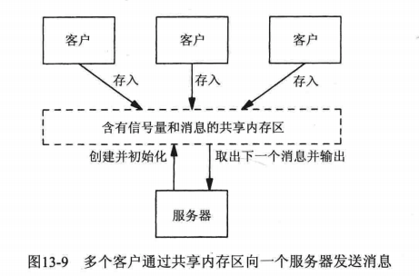

[TOC]

# Posix共享内存区
Posix.1提供了两种无亲缘关系进程间共享内存区的方法：（都需要调用mmap）
* 内存映射文件(memory-mapped file)：由open函数打开，由mmap函数把得到的描述符映射到当前进程地址空间中的一个文件。
* 共享内存区对象(share-memory object)：由shm_open打开一个Posix.1 IPC名字，所返回的描述符由mmap函数映射到当前进程的地址空间。


## 1. 相关函数
```c
#include <sys/mman.h>
#include <fcntl.h>
#include <sys/types.h>
#include <sys/stat.h>
#include <unistd.h>

// 只是打开一个内存区对象，返回fd
// oflag: 必须函数O_RDONLY、O_RDWR中的一个。
// mode: 
//  * 指定权限为，在指定了O_CREAT的前提下使用。
//  * 与mq_open和sem_open不同，shm_open的mode参数必须指定。
int shm_open(const char *name, int oflag, ...);
// 删除一个共享内存区对象的名字。（删除一个名字不会影响低层支撑对象的现有引用。）
int shm_unlink(const char *name);

// 裁剪普通文件或者共享内存区对象
int ftruncate(int fd, off_t length);

//获取打开的共享内存对象的信息
int fstat(int fildes, struct stat *buf);
```

## 2. 示例
* 共享计数器持续+1
    * [示例6_1](./Examples/6_1_ex_pxshm_server1.c)
    * [示例6_2](./Examples/6_2_ex_pxshm_client1.c)
* 向服务器发送消息
    * 
    * 

## A.注意
* 在macOS 10.14.5中，shm_open并不会创建对应的同名文件。
    * 详见[示例1](./Examples/1_ex_shm_create.c)

## B.问题
* 为什么shm_open不直接返回共享内存的地址？
    * 因为Posix.1的共享内存发明之前，mmap已经存在。
    * mmap使用的是已打开的描述符。


