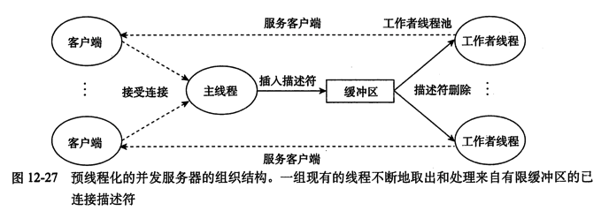

[TOC]

# 线程
* 当一个程序由exec启动执行时，系统将创建一个称为`初始线程(initail thread)`或`主线程(main thread)`的单个线程。
* 线程取消在`8.5`章，被取消的线程要释放相关资源（锁等），需要注意。
* 线程创建可能比进程创建快10~100倍；
* 线程或者是`可汇合的(joinable)`或者是`脱离/分离的(detached)`。（默认`可汇合的`）
    * 可汇合的线程可以被其他线程回收其资源和杀死。
        * 当可汇合的线程终止时，其线程ID和退出状态将保留，直到另一个线程调用pthread_join;
    * 脱离的线程则像守护进程：终止时，所有资源都释放，因此不能等待它终止；
* 线程是运行在进程上下文中的逻辑流。

## 1. 共享及私有
线程共享的内容：
* 进程指令；
* 大多数数据；
* 打开的文件（如描述符）；
* 信号处理程序和信号处置；
* 当前工作目录；
* 用户ID和组ID；
线程私有的内容：
* 线程ID；
* 寄存器集合（包括程序计数器和栈指针）；
* 栈；
* 栈指针；
* 程序计数器；
* errno；
* 信号掩码；
* 优先级；

## 2. 相关函数
### 2.1 pthread_create
```c
#include <pthread.h>

int pthread_create(pthread_t *thread, const pthread_attr_t *attr,
                    void *(*start_routine)(void *), void *arg);
```
* 作用：创建线程
* 参数：
    * tid：线程ID；这是`结果`参数；
    * attr: 线程属性，如优先级、初始栈大小、是否是一个守护线程等；通常采用默认值；
    * start_routine: 创建的线程所需要执行的函数；称为`线程启动函数(thread start function)`;
    * arg: 参数；如果有多个，则打包成一个结构即可；
* 返回：
    * 成功：0
    * 失败：Exxx值

### 2.2 pthread_join
```c
int pthread_join(pthread_t tid, void **status);
```
* 作用：等待一个线程结束/终止；（不是任意一个线程的终止都能等待）
* 参数：
    * tid：等待线程的线程id；
    * status：等待线程的终止状态；
* 返回：
    * 成功：0
    * 失败：Exxx值
    
### 2.3 pthread_self
```c
pthread_t pthread_self(void);
```
* 作用：获取自身的线程ID；
* 参数：无
* 返回：调用线程的线程ID；

### 2.4 pthread_detach
```c
int pthread_detach(pthread_t tid);
```
* 作用：将指定线程变为脱离的。
* 参数：
    * tid：线程id；
* 返回：
    * 成功：0
    * 失败：Exxx值
* 通常用法：`pthread_detach(pthread_self());`


### 2.5 pthread_exit
```c
void pthread_exit(void *status);
```
* 作用：线程退出
* 参数：
    * status: 退出状态；不能指向局部于调用线程的对象，如该线程启动函数中的某个局部变量；
* 返回：
    * 成功：0
    * 失败：Exxx值
* 通常用法：`pthread_detach(pthread_self());`

### 2.6 pthread_cancel
```c
int pthread_cancel(pthread_t tid);
```
* 作用：退出指定线程
* 参数：
    * tid: 线程ID；
* 返回：
    * 成功：0
    * 失败：Exxx值


### 2.7 pthread_once
```c
#include <pthread.h>

pthread_once_t once_control = PTHREAD_ONCE_INIT;

int pthread_once(pthread_once_t *once_control, void (*init_routine)(void));
```
* 作用：初始化线程——初始化与线程例程相关的状态。
    * 当需要`动态`初始化多个线程共享的全局变量时，pthread_once是很有用的；
* 参数：
    * once_control：全局或者静态变量，总是被初始化为`PTHREAD_ONCE_INIT`;
    * init_routine：初始化例程。第一次用once_control调用pthread_once时，会调用init_routine;
* 返回：
    * 成功：0
    * 失败：Exxx值
    
## 3. 共享变量
一个变量是`共享的`，当且仅当多个线程引用这个变量的某个实例。（访问相同的东西）
解答以下问题，有助于理解C程序中一个变量是否是共享的：
* 线程的基础存储器模型是什么？
    * 一组并发线程运行在一个进程的上下文中；每个线程有自己的线程上下文；
    * 寄存器是不共享的；虚拟存储器是共享的；
* 根据这个模型，变量实例是如何映射到存储器的？
* 有多少线程引用这些实例？

## 4. 线程的终止
* 线程的终止方式：
    * 自身显式终止：pthread_exit;
    * 他人显式终止：pthread_join;
    * 隐式终止：函数返回；
    * 某个线程调用exit函数；
    
## 5. 线程安全
线程安全：被多个并发线程反复调用，仍然能一直产生正确的结果。
4类线程不安全函数：
* 不保护共享变量的函数；
* 保持跨越多个调用的状态的函数；
    * 当前结果依赖前面的结果。
```c
unsigned int next = 1;

// 返回0-32767的伪随机书
int rand(void)
{
    next = next * 1103515245 + 12345;
    return (unsigned int)(next / 65536) % 32768;
}

// 为rand()设置种子
void srand(unsigned int seed)
{
    next = seed;
}
```
* 返回指向静态变量的指针的函数；
    * 正在被一个线程使用的结果可能会被另一个线程悄悄覆盖。
    * 解决方法：
        * 1.重写；传递结果参数；
        * 2.使用`加锁-拷贝`技术；
* 调用线程不安全函数的函数；
    * 加锁可能可以转变为线程安全函数；

## 6. 可重入性
* 可重入性：被多个线程调用时，不会引用任何共享数据。（因此不需要同步操作）
    * 可重入函数是线程安全函数的一个真子集。
* 显式可重入：函数都是值传递，所有数据引用都是本地的自动栈变量。（没有引用静态或全局变量）
* 隐式可重入：`显式重入`基础上，允许引用传递的参数（即传递指针）。
```
// 隐式可重入示例
int rand_r(unsigned int *nextp)
{
    *nextp = *nextp * 1103515245 + 12345;
    return (unsigned int)(*nextp / 65536) % 32768;
}
```

## 7. 竞争
* 现成话的程序必须对任何可行的轨迹线都正确工作。
* [示例1_3_ex](./Examples/1_3_ex_sharing_thread.c)


## 8. 死锁
* 信号量引入一种潜在的运行时错误：死锁(deadlock)。
    * 一组线程被阻塞，等待一个永远不会为真的条件。
* 互斥锁加锁规则：用相同的顺序加锁。

## A.拓展
* 预线程化：生成一个管理线程+多个工作线程；
    * 用一个`有限`缓冲区存储数据，这些数据被工作线程处理。
