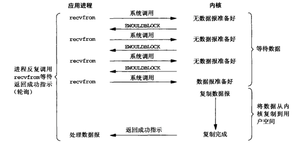
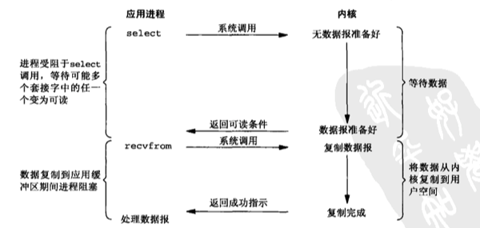
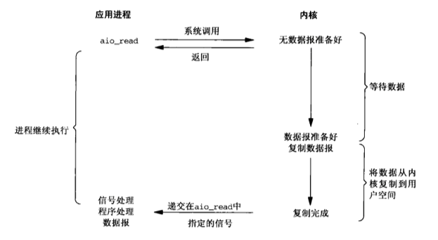

[TOC]

# I/O复用
I/O复用的的典型使用场合：
* 当客户需要处理多个描述符(通常是交互式输入和网络套接字)时。
* 当可以需要同时处理多个套接字时。（比较少见）
* 一个服务器既要处理TCP，又要处理UDP。
* 一个服务器要处理多个服务或者多个协议。
**I/O复用并非只限于网络编程！**

## 1. I/O模型
Unix下可用的5中I/O模型：
* 阻塞式I/O；
* 非阻塞式I/O；
* I/O复用(select/poll)；（又被称为：`事件驱动式I/O`）
* 信号驱动式I/O(SIGIO)；
    * 让`内核`在描述符就绪时，发送`SIGIO`信号通知相关进程。
* 异步I/O(POSIX的aio_系列函数)

### 1.1 阻塞式I/O模型

### 1.2 非阻塞式I/O模型

### 1.3 I/O复用模型

### 1.4 信号驱动式I/O模型

### 1.5 异步I/O模型

* 和信号驱动式I/O不同的是：数据到缓冲区复制完成后，才发送信号。

### 1.6 5种I/O模型的比较

## A. 问题
1.什么是异步I/O操作？什么是同步I/O操作？
* 同步I/O操作：导致请求进程阻塞，知道I/O操作完成。
* 异步I/O操作：不导致请求进程阻塞。
* 上面的5种模型，只有`异步I/O模型`是异步I/O操作。 