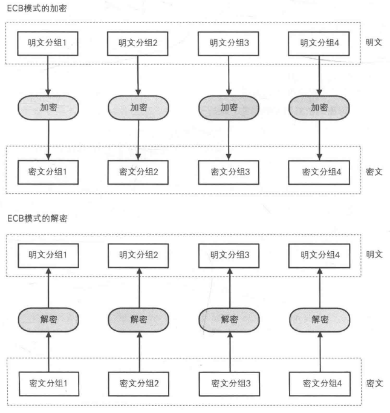
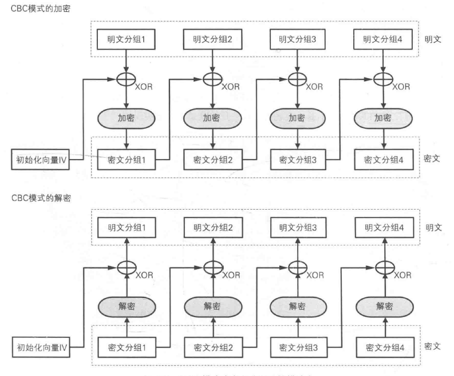
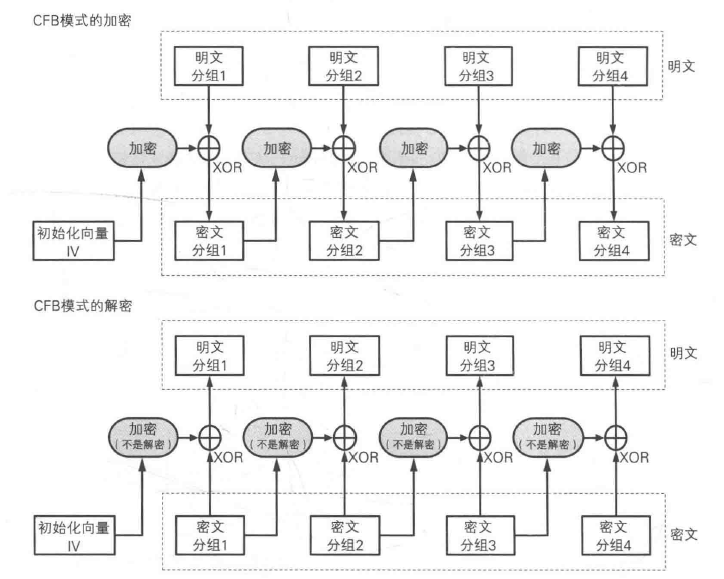
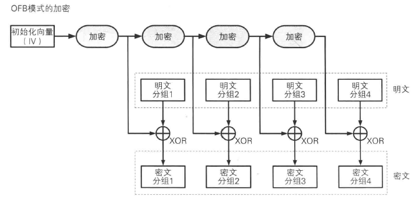
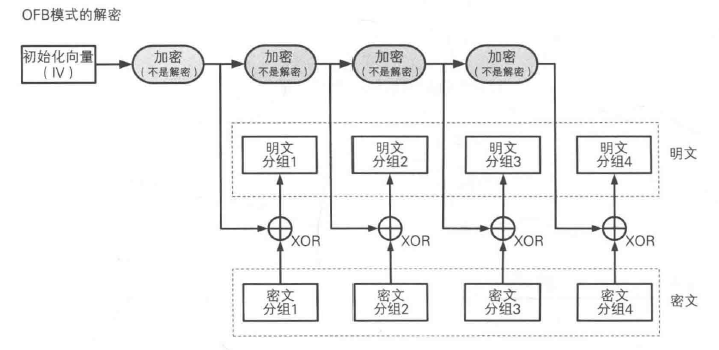
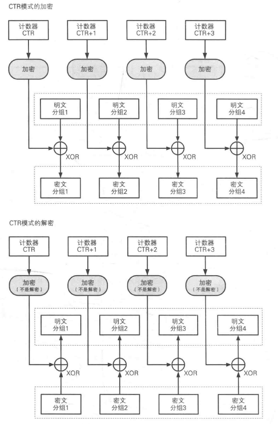
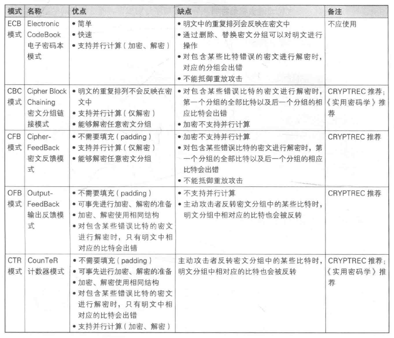

[TOC]

第四章 分组密码的模式
---
DES和AES都属于分组密码，它们只能加密固定长度的明文。
如果需要加密任意长度的明文，则需进行迭代，而分组密码的`迭代方法`，就称为分组密码的`模式`。

# 分组密码与流密码
密码算法可以分为`分组密码`和`流密码`。
流密码：一次性密码本
分组密码：DES、AES、3DES等大多数堆成密码算法。

# 模式分类
* ECB：Electronic CodeBook mode，电子密码本模式。
* CBC：Cipher Block Chaining mode，密码分组链接模式。
* CFB：Cipher FeedBack mode，密文反馈模式。
* OFB：Output FeedBack mode，输出反馈模式。
* CTR：CounTeR mode，计数器模式。
* GCM：Galois/Counter Mode, 。

# 初始化向量
由于加密第一个分组时，不存在“前一个密文分组”，因此事先准备一个长度为一个分组的bit序列来代替。此序列称为`初始化向量(Initialization Vector, IV)`
* 初始化向量必须使用不可预测的随机数。

# ECB模式
电子密码本模式：切割明文为多个分组，逐个加密。（容易有安全漏洞，不要使用）
* 加解密过程图示

# CBC模式
密码分组链接模式：密文分组像链条一样互相连接在一起。（前一个密文分组用于后一个分组的加密）
* 特点
  * 无法直接对中间分组进行加密。
  * 一个密文分组损坏，解密时最多只有两个明文分组受影响。（在密文长度没变的情况下）
* 加解密过程图示

# CFB模式
密文反馈模式：前一个密文分组被送到密码算法的输入端，用于生成下一个密文分组。
* 特点
  * 依赖上一个密文分组。
* 加解密过程图示

# OFB模式
输出反馈模式：加密算法的输出作为下一个分组加密算法的输入。
* 特点
  * 不依赖上一个密文分组。生成秘钥流的操作和进行XOR运算的操作可以并行。
* 加解密过程图示

# CTR模式
计数器模式：通过将逐次累加的计数器进行加密来生成密钥流的`流密码`。
* 加解密过程图示

## 计数器的生成方法
以128bit长度分组为例：
* 前8个字节为`nonce`，每次加密时必须都不同。
* 后8字节为分组序号，逐次累加。

# GCM模式
* 第八章

# 模式对比

