[TOC]

漏洞扫描
---

本文主要介绍如何使用 nessus 进行主机扫描以及使用 snyk 进行 Docker 镜像扫描。

# 1. 主机扫描

## 1.1 安装 nessus

**注意：需要空间 20 GB。**

* 打开 [nessus 官网](https://zh-cn.tenable.com/products/nessus/nessus-essentials?tns_redirect=true)
* 注册：
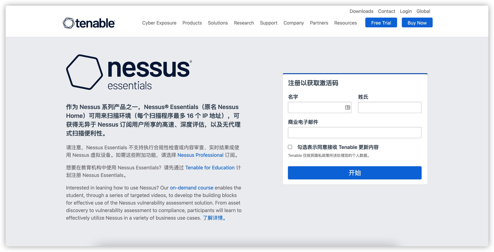

* 进入 [nessus 下载页](https://www.tenable.com/downloads/nessus?loginAttempted=true) 下载：
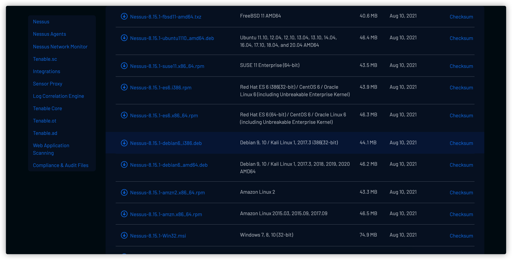

* 安装

    ```
    rpm -i Nessus-8.15.1-es7.x86_64.rpm
    ```

* 启动

    ```
    /bin/systemctl start nessusd.service
    ```

* 进入管理界面: https://10.0.0.199:8834/

* 设置账号密码

* 初始化及编译插件
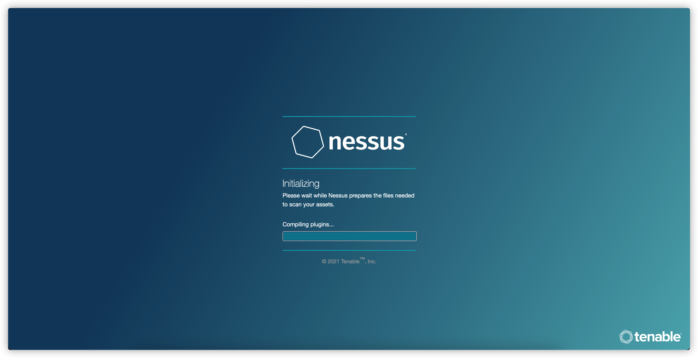


## 1.2 使用 nessus

* 添加 scan
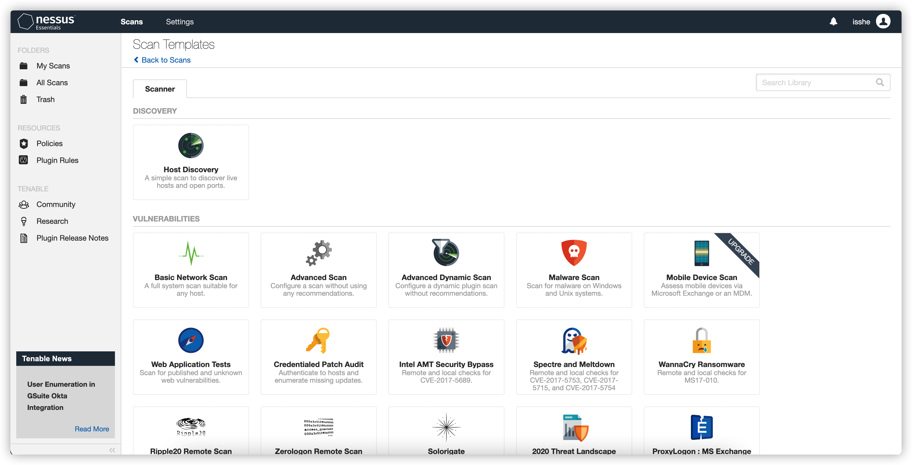
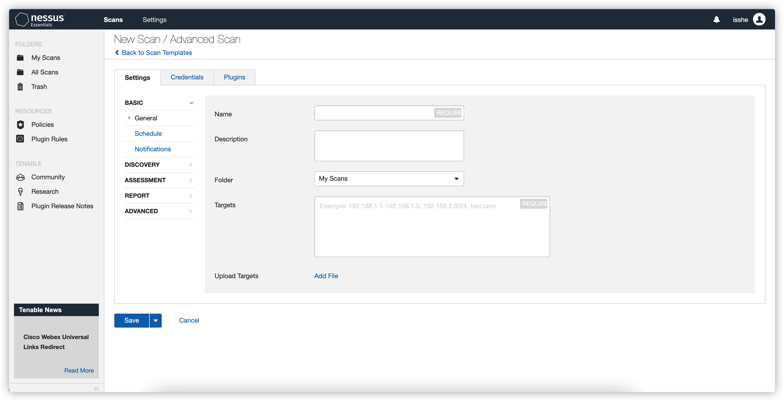

* 执行 scan 并查看结果
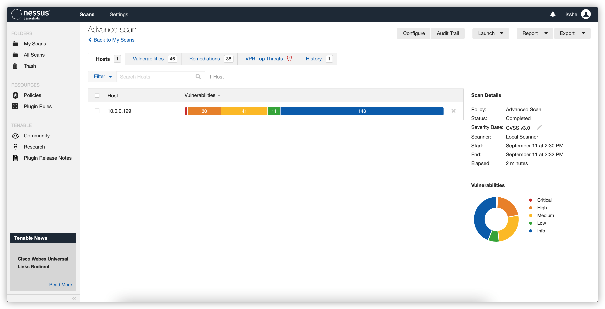
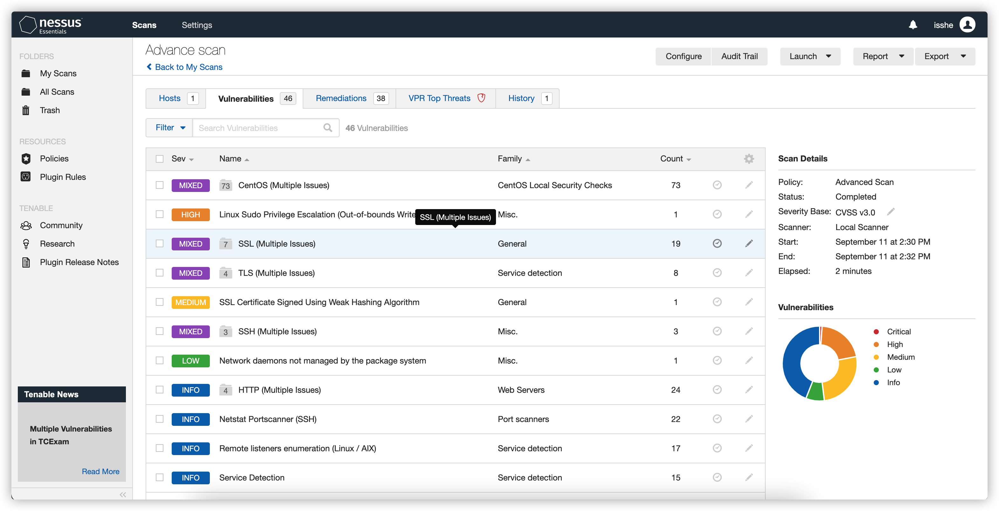

# 2. 容器扫描

## 2.1 安装 snyk

**如果你的容器在 docker hub 等 registries 中，可以不用在本地安装 snyk。**

```
wget https://static.snyk.io/cli/latest/snyk-linux
mv ./snyk-linux /usr/local/bin/snyk
chmod +x /usr/local/bin/snyk
```

## 2.2 使用 snyk

无论使用云端还是本地版本，都需要注册 snyk 账号。
请在 [snyk 官网](https://app.snyk.io/)注册。

### 2.2.1 使用云端 snyk
* 添加项目：点击 Add Project
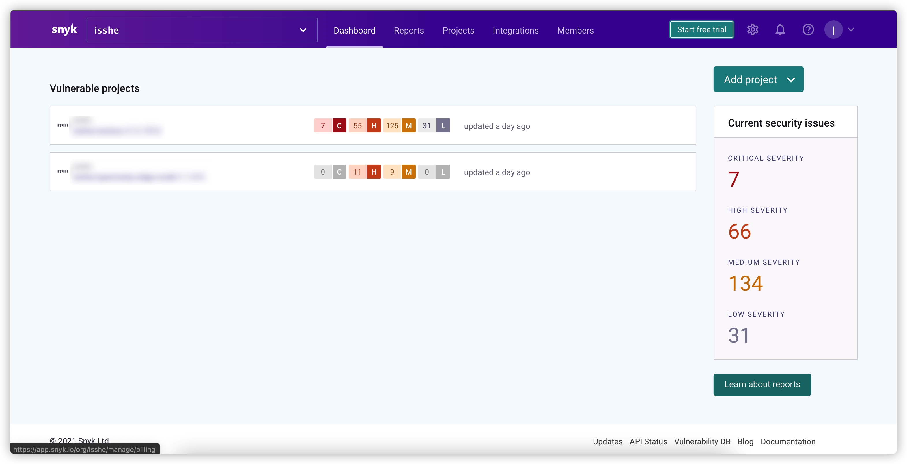

* 选择 registries
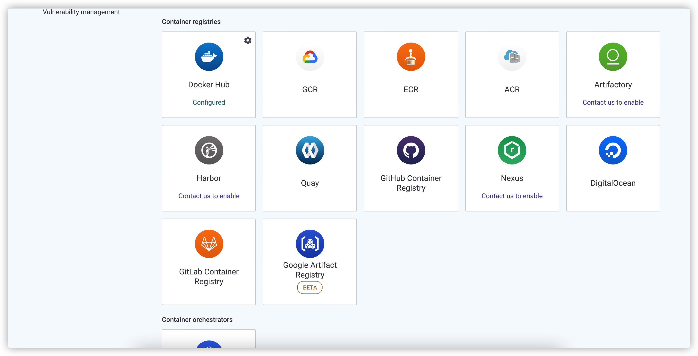

* 选择镜像
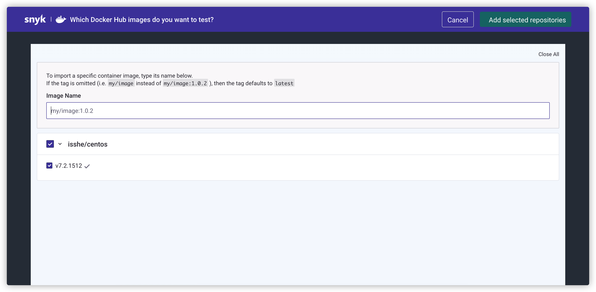

* 查看结果
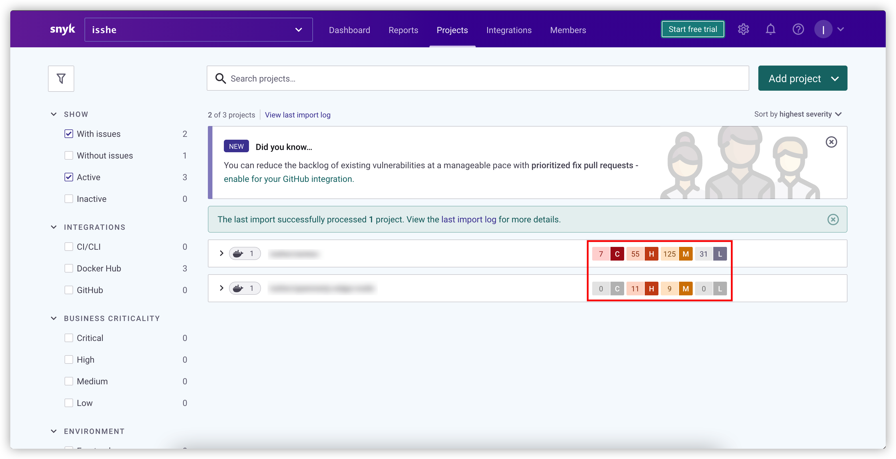
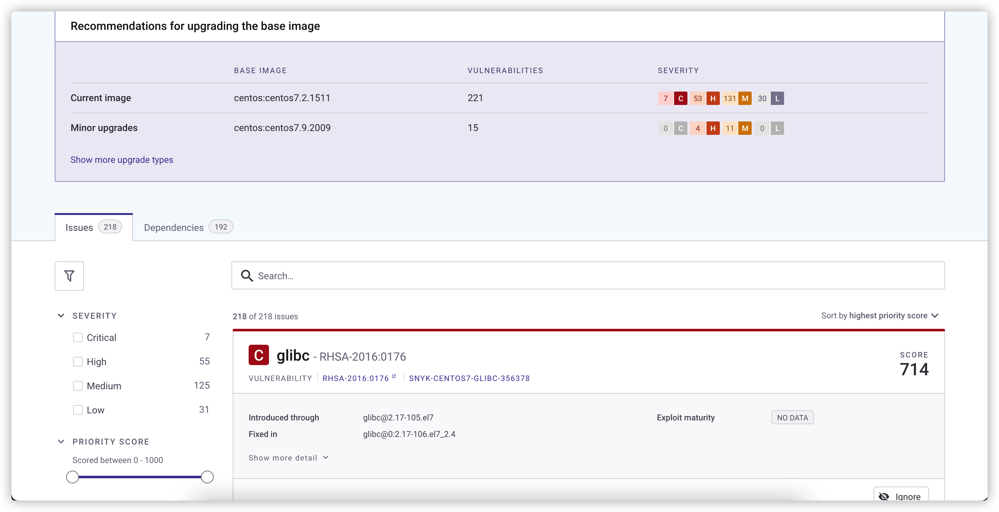

可以看到具体的漏洞情况以及解决方法。

### 2.2.1 使用本地 snyk

* 登录：`snyk auth <Token>`
    * Token 在页面端生成

* 扫描：`snyk container test <Image name>`

* 结果：
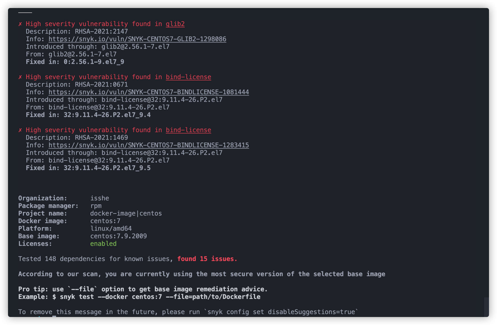
