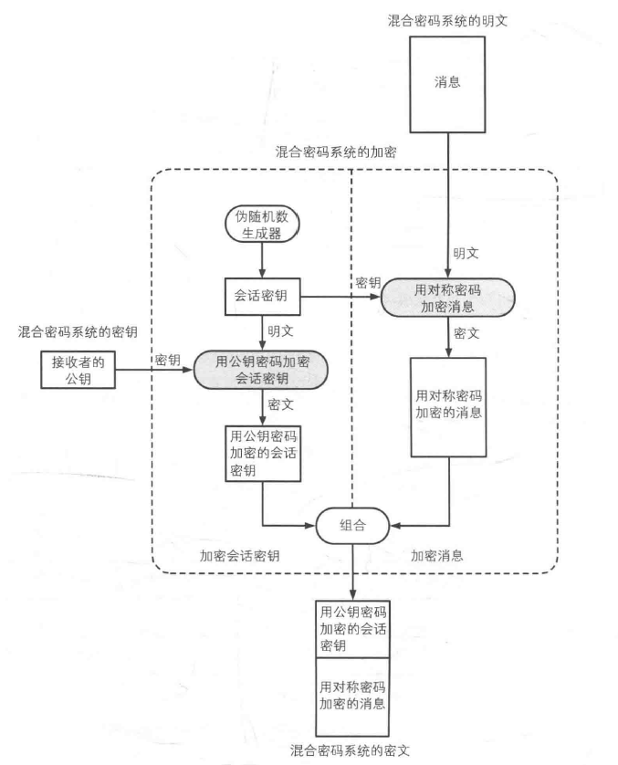
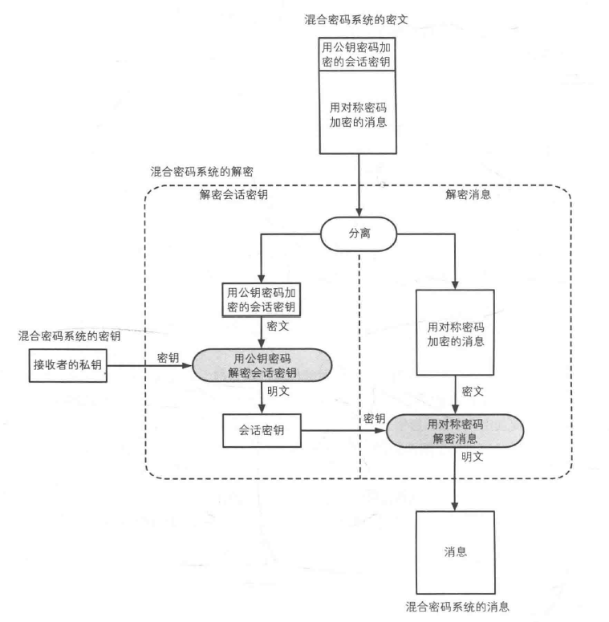

[TOC]

第六章 混合密码系统
---
用对称密码提高速度，用公钥密码保护会话密钥。
* 对称密码：用于加密消息/数据。
* 公钥密码：用于加密密钥/会话密钥。
* 对称密码和公钥密码的密钥长度必须具备同等强度。
  * 考虑长期运用时，公钥密码的强度应该要高于对称密码。
  * 因为对称密码的会话密钥被破解，只会影响到本次通信，而公钥被破译，会影响过去到未来所有通信内容。

密钥强度对比：
|对称密码 AES|公钥密码 RSA|
|---|---|
|128|3072|
|192|7680|
|256|15360|

# 问题
* 对称密码：
  * 密钥传送问题
* 公钥密码：
  * 中间人攻击
  * 速度慢

# 混合密码加密过程

# 混合密码解密过程
