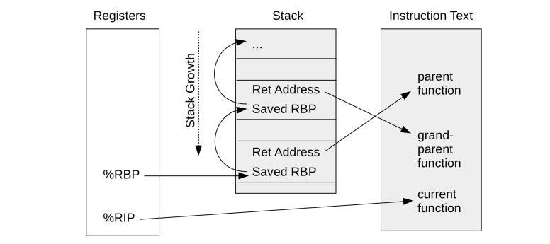
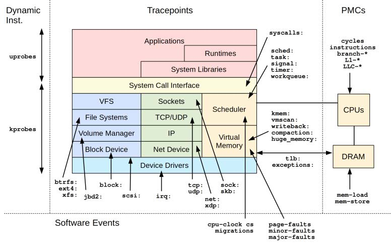

# 第2章 技术背景


## 2.1 图释 BPF

BPF 技术之间的联系：


## 2.3 拓展版 BPF

BPF 运行时的内部结构：


### 2.3.6 BPF API

BPF 辅助函数

* 见 include/uapi/linux/bpf.h, 有函数列表及描述、返回。

BPF 系统调用命令

* 见 include/uapi/linux/bpf.h 的 bpf_cmd。

BPF 程序类型

* 见 include/uapi/linux/bpf.h 的 bpf_prog_type。

BPF 映射类型

* 见 include/uapi/linux/bpf.h 的 bpf_map_type。

### 2.3.8 BPF sysfs 接口

在 Linux 4.4 中 BPF 引入了相关命令，可以将 BPF 程序和 BPF 映射通过虚拟文件系统显露出来，位置通常在 `/sys/fs/bpf`，这个能力用术语表示为钉住（pinning）。

使用场景：
* 创建持续运行的 BPF 程序（想 daemon 程序那样）：即使创建程序的进程退出，程序仍可运行。
* 用于用户态和正在运行的 BPF 程序交互：用户态读取、修改映射表。

### 2.3.9 BPF 类型格式（BTF）

BTF（BPF Type Format，BPF 类型格式）是一个元数据的格式，用来将 BPF 程序的源代码信息编码到调试信息中。
选这个名称是因为它描述了数据类型，不过后来被拓展到包含函数信息、源代码、全局变量等信息。

详见：Documentation/bpf/btf.rst。

### 2.3.10 BPF CO-RE

一次编译，到处执行（Compile Once - Run Everywhere，CO-RE）。

比 BCC 更有优势，值得学习。

[BPF 二进制文件：BTF，CO-RE 和 BPF 性能工具的未来](https://www.ebpf.top/post/bpf-co-re-btf-libbpf/)
[BCC 到 libbpf 的转换指南](https://www.ebpf.top/post/bcc-to-libbpf-guid/)

### 2.3.11 BPF 的局限性

* BPF 程序不能随意调用内核函数；只能调用在 API 中定义的 BPF 辅助函数。
* 不允许无限循环。
* BPF 栈大小不能超过 MAX_BPF_STACK，值为 512。
* BPF 程序的总指令数量有限制，Linux 5.2 后是 100 万个（BPF_COMPLEXITY_LIMIT_INSNS），非特权程序是 4096 个（BPF_MAXINSNS）。

## 2.4 调用栈回溯

帧指针并不是进行栈回溯的唯一方法，还可以使用调试信息（debuginfo）、最后分支记录（LBR）以及 Oops 回滚能力（ORC）。

基于帧指针的调用栈回溯：



## 2.5 火焰图

火焰图的特点：
* 每个方块代表一个“栈帧”。
* Y 轴显示了栈的深度（栈帧的数量），底部是根，顶部是叶子。
* X 轴包含了全部的采样样本数量。从左到右只是按字母顺序排序，与时间无关。
* 顶部的方块就是此刻运行在 CPU 上的函数。

## 2.6 事件源

BPF 对事件的支持：



## 2.7 kprobes

> kprobes 向 BCC 和 bpftrace提供了内核`动态插桩`的机制。

BPF 接口：
* BCC：attach_kprobe()、attach_kretprobe()
* bpftrace：kprobes 和 kretprobe 探针类型

bpftrace 示例：统计所有`vfs_`开头的函数的调用次数。

```
bpftrace -e 'kprobe:vfs_* { @[probe] = count() }'
```

kprobes 工作方式：

* 将一个快速断点指令（如 int3）插入目标指令处，该指令将执行权转交给 kprobes 处理函数。
* 当不再需要 kprobes 时，目标指令恢复成原来的样子。
* kretprobes 也是在**函数入口**处使用**kprobe**进行插桩，在函数返回之前，使用一个蹦床函数对返回地址进行劫持。

详见《PBF 之巅》第 50 页

拓展阅读：

* 内核代码 Documentation/kprobes.txt 或 Documentation/trace/kprobes.rst
    * https://www.kernel.org/doc/Documentation/kprobes.txt
* An introduction to kprobe
* Kernal Debugging with kprobes

## 2.8 uprobes

> uprobes 提供了用户态程序的`动态插桩`。

uprobes 可以在用户态程序以下位置插桩：函数入口、特定偏移处、函数返回处。

uprobes 是基于文件的，当一个可执行文件中的一个函数被跟踪时，所有用到这个文件的进程都会被插桩。
这样就可以再全系统范围内跟踪系统库调用。

BPF 接口：
* BCC：attach_uprobe()、attach_uretprobe()
* bpftrace：uprobes 和 uretprobe 探针类型

uprobes 工作方式：

> 和 kprobes 类似

bpftrace 示例：对 readline 函数进行插桩。

* 新建窗口执行 `/bin/bash`
* 新建窗口执行插桩

```bpftrace
bpftrace -e 'uprobe:/bin/bash:readline { @ = count() }'
```

* 新建窗口进行 gdb 跟踪：`gdb -p <pid of /bin/bash>`
* 执行 gdb 命令：`disas readline`
* 可以看到第一个指令是 int3（原来不是int3，已被替换成int3）
* 此时退出跟踪；重新执行 gdb 命令查看，会发现指令恢复了。

BCC 示例：对 DNS 跟踪。（通过对 getaddrinfo() 和 gethostbyname() 插桩）

```
gethostlatency-bpfcc

# TIME      PID    COMM                  LATms HOST
# 03:45:28  10144  curl                   3.63 baidu.com
# 03:45:31  665    exe                    1.35 metrichub-cn-shenzhen.aliyun.com
# 03:45:50  10302  curl                 450.70 ifconfig.io
```

**注意：uprobe 跟踪 malloc/free 之类的高频事件时，可能会导致性能问题。（不知道现在解了没有，详见 《BPF 之巅》 2.8.4 节）**

拓展阅读：

* Documentation/trace/uprobetracer.rst

## 2.9 tracepoints 跟踪点

> tracepoints 可以用来对内核进行`静态插桩`。

tracepoints 的主要优势是：API 比较稳定。如果条件允许，应该先尝试使用跟踪点，再有在条件不满足时，才使用 kprobes。

tracepoints 的格式 `子系统:事件名`（subsystem:eventname，如 kmem:kmalloc）

BPF 接口：

* BCC: TRACEPOINT_PROBE()
* bpftrace: 跟踪点探针类型

bpftrace 使用跟踪点示例：对 sched:sched_process_exec 进行插桩

```bpftrace
bpftrace -e 'tracepoint:sched:sched_process_exec { printf("exec by %s\n", comm); }'
```

拓展阅读

* Documentation/trace/tracepoints.rst

## 2.10 USDT

> USDT 是用户态的`静态插桩`。

USDT：用户态预定义静态跟踪（user-level statically defined tracing）

许多应用默认不开启 USDT，显式开启需要使用配置参数 `--enable-dtrace-probes` 或者 `--with-dtrace`。
