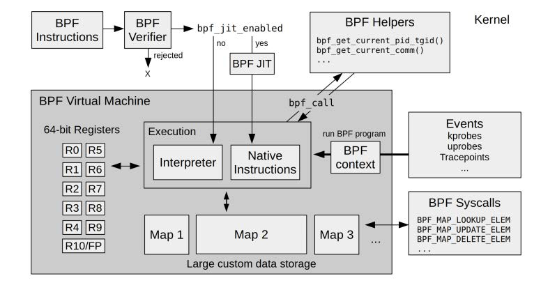

第2章 技术背景
---

# 2.1 图释 BPF

BPF 技术之间的联系：

# 2.3 拓展版 BPF

BPF 运行时的内部结构：

## 2.3.6 BPF API

BPF 辅助函数

* 见 include/uapi/linux/bpf.h, 有函数列表及描述、返回。

BPF 系统调用命令

* 见 include/uapi/linux/bpf.h 的 bpf_cmd。

BPF 程序类型

* 见 include/uapi/linux/bpf.h 的 bpf_prog_type。

BPF 映射类型

* 见 include/uapi/linux/bpf.h 的 bpf_map_type。

## 2.3.8 BPF sysfs 接口

在 Linux 4.4 中 BPF 引入了相关命令，可以将 BPF 程序和 BPF 映射通过虚拟文件系统显露出来，位置通常在 `/sys/fs/bpf`，这个能力用术语表示为钉住（pinning）。

使用场景：
* 创建持续运行的 BPF 程序（想 daemon 程序那样）：即使创建程序的进程退出，程序仍可运行。
* 用于用户态和正在运行的 BPF 程序交互：用户态读取、修改映射表。

## 2.3.9 BPF 类型格式（BTF）

BTF（BPF Type Format，BPF 类型格式）是一个元数据的格式，用来将 BPF 程序的源代码信息编码到调试信息中。
选这个名称是因为它描述了数据类型，不过后来被拓展到包含函数信息、源代码、全局变量等信息。

详见：Documentation/bpf/btf.rst。

## 2.3.10 BPF CO-RE

一次编译，到处执行（Compile Once - Run Everywhere，CO-RE）。

比 BCC 更有优势，值得学习。

[BPF 二进制文件：BTF，CO-RE 和 BPF 性能工具的未来](https://www.ebpf.top/post/bpf-co-re-btf-libbpf/)
[BCC 到 libbpf 的转换指南](https://www.ebpf.top/post/bcc-to-libbpf-guid/)

## 2.3.11 BPF 的局限性

* BPF 程序不能随意调用内核函数；只能调用在 API 中定义的 BPF 辅助函数。
* 不允许无限循环。
* BPF 栈大小不能超过 MAX_BPF_STACK，值为 512。
* BPF 程序的总指令数量有限制，Linux 5.2 后是 100 万个（BPF_COMPLEXITY_LIMIT_INSNS），非特权程序是 4096 个（BPF_MAXINSNS）。

# 2.4 调用栈回溯

帧指针并不是进行栈回溯的唯一方法，还可以使用调试信息（debuginfo）、最后分支记录（LBR）以及 Oops 回滚能力（ORC）。

基于帧指针的调用栈回溯：

# 2.5 火焰图

火焰图的特点：
* 每个方块代表一个“栈帧”。
* Y 轴显示了栈的深度（栈帧的数量），底部是根，顶部是叶子。
* X 轴包含了全部的采样样本数量。从左到右只是按字母顺序排序，与时间无关。
* 顶部的方块就是此刻运行在 CPU 上的函数。

# 2.6 事件源

BPF 对事件的支持：

