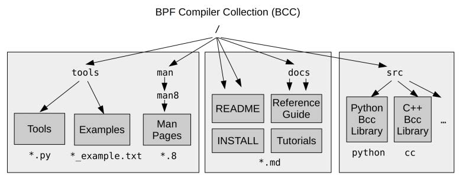

# 第4章 BCC

BCC：BPF 编译器集合，BPC Compiler Collection。

BCC 适用于创建复杂的、带有各种命令行参数、完全可定制的输出和动作的工作。
bpftrace 更适用于编写单行程序，或者不接受命令行参数/单个参数，只打印文本输出。

## 4.1 BBC 的组件



## 4.5 funccount

funccount 用于对事件进行计数。

它可以回答以下问题：
- 某个内核态或用户态函数是否被调用过？
- 该函数每秒被调用了多少次？


## 4.6 stackcount

stackcount 对导致某事件发生的函数调用栈进行计数。
事件源：内核态函数、用户态函数、内核跟踪点、USDT 探针。

stackcount 可以回答以下问题：
- 某个事件为什么会被调用？调用的代码路径是什么？
- 有哪些不同的代码路径会调用该事件，它们的调用频次如何？

开销预期会比 funccount 高一些。


## 4.7 trace

trace 是一个 BCC 多用途工具，可以针对多个数据源进行每个事件的跟踪，支持 kprobes、uprobes、tracepoints 和 USDT 探针。

可以用来回答以下问题：
- 当某个内核态/用户态函数被调用时，调用参数是什么？
- 这个函数的返回值是什么？调用失败了吗？
- 这个函数是如何被调用的？相应的用户态或内核态函数调用栈是什么？

trace 会对每个事件产生一行输出，因此适合用于**低频事件**。

## 4.8 argdist

argdist 是一个针对**函数调用参数**分析的多用途工具。

使用示例：

- 查看 TCP 窗口大小

```shell
argdist -H 'r::__tcp_select_window():int:$retval'
```

- 查看读取延迟大于 0.1 毫秒的进程

```shell
argdist-bpfcc -C 'r::__vfs_read():u32:$PID:$latency > 100000'
```
