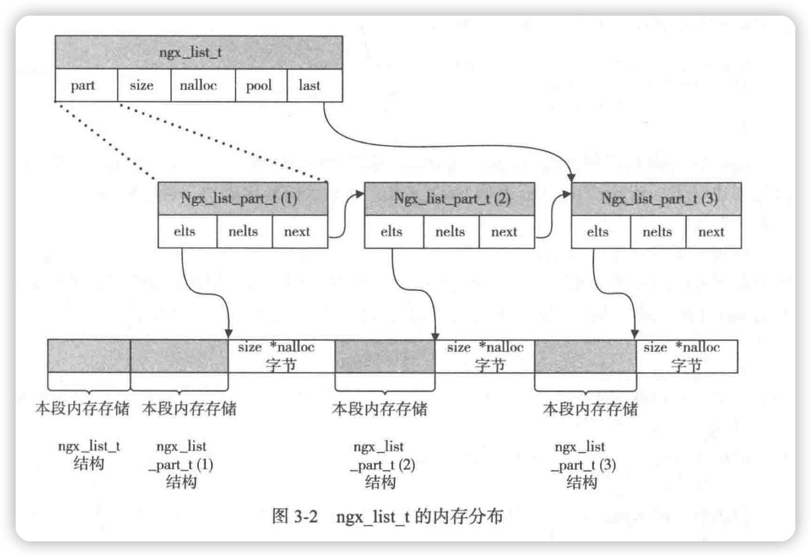

Nginx 的数据结构
---

此文档的目的：简要记录各种数据结构的适用场景，后续需要用到时，再细查。

- ngx_list_t：链表容器，在 Nginx 中使用频繁，例如用于存储 HTTP 头部。
    * ngx_list_part_t: 用于描述 ngx_list_t 中的元素，是一个数组，拥有连续的内存。

- ngx_table_elt_t：用于存储 key/value 对。也可以是 ngx_hash_t 结构中的成员。
- ngx_buf_t：Nginx 处理大数据的关键数据结构。它既应用于内存数据也应用于磁盘数据。
- ngx_chain_t：与 ngx_buf_t 配合使用的链表结构。
- ngx_command_t：用于定义一个配置指令。
