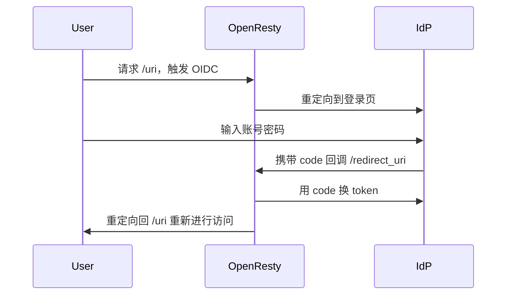

# Markdown 用法

## 绘制流程图

```mermaid
sequenceDiagram
    participant User
    participant OpenResty
    participant IdP

    User->>OpenResty: 请求 /uri，触发 OIDC
    OpenResty->>IdP: 重定向到登录页
    User->>IdP: 输入账号密码
    IdP->>OpenResty: 携带 code 回调 /redirect_uri
    OpenResty->>IdP: 用 code 换 token
    OpenResty ->>User: 重定向回 /uri 重新进行访问
```

在线制作网址：

- https://mermaid-live.nodejs.cn/
  - https://mermaid.nodejs.cn/
- https://mermaid.live/
