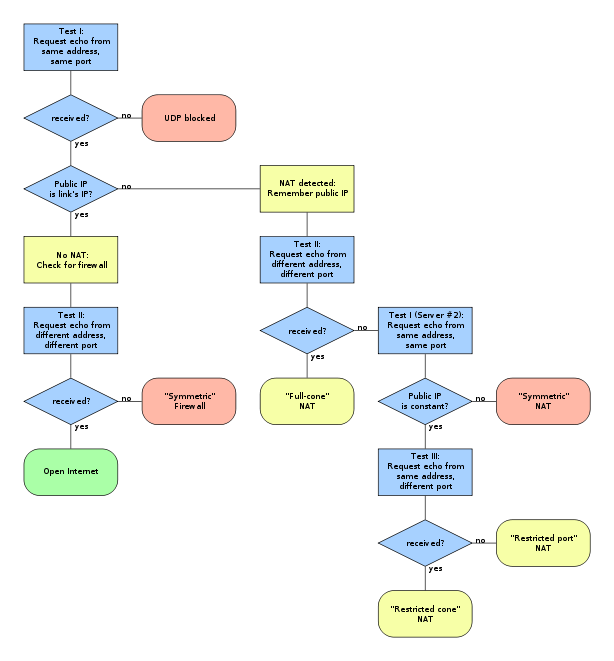

[TOC]

# NAT 类型检测工具

## 1.前置依赖

假设环境为 ubuntu 环境：
* lua: `sudo apt-get install lua luarocks`
* luasocket: `sudo luarocks install luasocket`
* lua-cjson: `sudo luarocks install lua-cjson`

## 2. 拓扑图
```
                 [Server1]
                /
[Client] - [NAT]
                \
                 [Server2]
```
* Server1 和 Server2 可以是一台设备的两个 Wan 口，或者是两台设备。


## 3.使用方法
* 修改 stun_server3.lua 里面的 IP+ 其他服务器 IP，然后运行第一个服务器。
* 修改 stun_server3.lua 里面的 IP+ 其他服务器 IP，然后运行第二个服务器。
* 修改 stun_client3.lua 里面的客户端 IP，服务器 IP（两个）
* 运行 stun_client3.lua，进行测试。

## 4.检测方法
* 检测流程

* Test I: 内网客户端发送信息给外网服务器，外网服务器（用相同的 IP 和相同的端口）直接回复。
* Test II: 内网客户端发送信息给外网服务器，外网服务器（用不同的 IP 和不同的端口）回复。（要求服务器有多个 IP 或者有多个服务器）
* Test III: 内网客户端发送信息给外网服务器，外网服务器（用相同的 IP 和不同的端口）直接回复。
* 如果没理解错，"Symmetric NAT"检测那里，应该是两次`Test I`后，两次得到的 NAT 映射的公网 IP 和端口都相同（图片中只有公网 IP 不同）。

## 5.使用示例
* 拓扑图
```
                                       [Server1](192.168.2.B)
                                      /
[Client](172.16.0.X) - (172.16.0.Y)[NAT](192.168.2.A)
                                      \
                                       [Server2](192.168.2.C)
```
* 步骤
* 开第一个服务器：
```shell
lua ./stun_server.lua 192.168.2.B 192.168.2.C
```
* 开第二个服务器：
```shell
lua ./stun_server.lua 192.168.2.C 192.168.2.B
```
* 运行客户端进行测试：
```shell
lua ./stun_client.lua 172.16.0.X 192.168.2.B 192.168.2.C
```

## X.参考
* https://zh.wikipedia.org/wiki/STUN